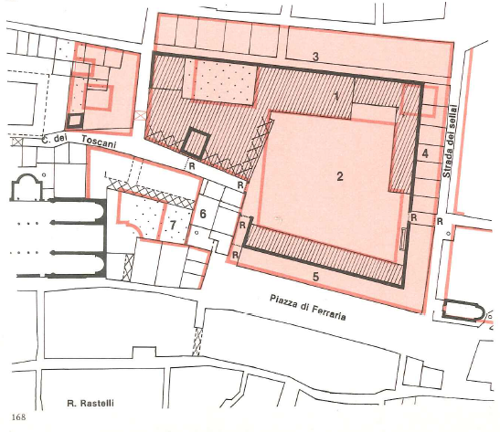
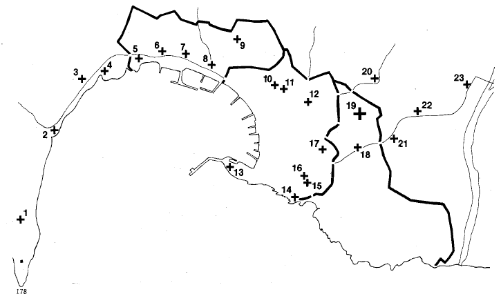

# La città nelle fonti del secolo XV

## Premessa

Alla base di questo studio è un tentativo di lettura del fatto urbano a livelli cronologici significativi per coglierne l'individualità attraverso la dinamica storica, e capire il senso di stratificazioni edilizie altrimenti illeggibili.

Si è chiarito nell'introduzione come il nostro contributo, per poter essere utile come vorremmo, ad un progetto di recupero della città storica, abbia bisogno di puntuali riferimenti alle situazioni territoriali. Per questo si è partiti a ritroso da elaborazioni dei catasti di epoca napoleonica, cominciando cioè da un'analisi della città preindustriale, come era giunta all'inizio del secolo scorso, alla soglia di un così diverso ciclo vitale. Si è passati poi ad una verifica dei mutamenti urbanistici ed edilizi nei secoli dal XVIII al XVI, basata soprattutto sulla documentazione grafica contenuta negli Atti dei Padri del Comune, per arrivare con sufficiente attendibilità, ad una restituzione della città all'inizio del XV secolo, appoggiata sulle precedenti elaborazioni e in particolare sugli elenchi scritti delle proprietà immobiliari cittadine, simili a quelli catastali, che sono nei registri della *Gabella possessionum* per gli anni dal 1369 al 1470.

Ne è risultata una rappresentazione topometrica spinta indietro nel tempo, al limite di quel medioevo che ha dato a Genova caratteri di forma così forti da costituirne ancora oggi non superabile condizionamento, un quadro fisico che ha permesso nei capitoli precedenti la correlazione e l'interpretazione della ricca, ma non organica documentazione urbanistico-architettonica che si è raccolta per i secoli dal XV all'XI ed oltre. E stato un viaggio indietro nel tempo, caratterizzato da una visione analitica dei fatti, che richiedeva un ritorno in cui le cose fossero viste in una luce di sintesi, nel naturale decorso cronologico. La premessa vuole chiarire perché in questi capitoli centrali di un più consapevole avvicinarsi alla realtà urbana ancora sperimentabile, la ricerca di coerenze generali si articoli in modo diverso, cerchi di superare le schematizzazioni e di cogliere la ricca morfologia delle tipologie urbanistico-edilizie, e delle loro leggi aggregative, si complichi con la preoccupazione di una necessaria selezione delle informazioni.

## Le fonti

All'archivio di Stato di Genova è conservato nel fondo dell'Antico Comune, il ricco anche se incompleto *corpus* dei registri della *Gabella possessionum*. Era una delle poche imposte dirette vigenti a Genova nel XV secolo, applicata alle proprietà immobiliari il cui introito, che alla metà del secolo era intorno alle 17000 lire, era devoluto interamente al Banco di San Giorgio.[^1]

Di questi .registri ne sono stati selezionati ed elaborati alcuni che hanno permesso di ottenere un quadro completo e ordinato, non solo della situazione patrimoniale immobiliare a Genova nel XV secolo, ma della stessa struttura urbanistica ed edilizia della città. Di particolare interesse è risultato il registro 559 relativo all'anno 1414 come il più ricco di annotazioni di dettaglio tali da consentire l'individuazione di singole unità immobiliari. Si tratta di una matricola dei contribuenti con la descrizione dei rispettivi beni, che registra però unicamente la proprietà degli alberghi nobiliari, e quindi fornisce nell'insieme un quadro incompleto.

Le case sono distinte secondo tipologie quali: *domus*, *domus magna*, *domuncula*, *turris*, *palacium* (riferito a edifici di villa) ecc., sono localizzate a livello di contrada e sempre coerenziate rispetto alle due confinanti laterali, alla eventuale posizione d'angolo, ecc. Ad ogni unità corrisponde una stima economica, finalizzata all'imposizione fiscale, che nel nostro studio è stata utile per valutazioni sulla consistenza relativa agli immobili. L'importanza del documento è emersa una volta verificate l'estensione e la collocazione delle proprietà registrate, che risultano coprire con una certa continuità buona parte delle aree centrali lungo l'arco della *Ripa maris*.

Salvo riconoscibili isole di residenza degli alberghi popolari, queste zone si integrano con gli insediamenti della popolazione artigiana, che erano sui terreni urbanizzati dalle comunità ecclesiastiche nel XIII secolo, già individuati con l'analisi di campionature dai registri *terraticorum* di chiese e di monasteri.[^2]

I dati forniti dal registro n. 559 sono stati così utilizzati per ricostruire intere porzioni di tessuto edilizio, ad un livello cronologico sensibilmente lontano nel tempo. Questo è stato possibile in quanto, come abbiamo verificato, vi è stata una sostanziale permanenza della struttura viaria primaria dal medioevo in poi, e in quanto si disponeva di un buon numero di punti di riferimento di sicura individuazione, o già noti, come le chiese e altre unità architettoniche di rilievo, o confermati da fonti di documentazione diverse e complementari, o acquisiti con rilevamenti archeologici condotti sul posto.[^3]

Un secondo registro della *Gabella possessionum* utilizzato a fondo è stato il Antico comune 591, per gli anni 1459–1464. Si tratta del censimento più completo offerto dalla serie riferito alle proprietà di case e di terre, urbane e suburbane, di nobili, di *popolares* e di enti religiosi. I nobili riuniti per «alberghi», gli altri proprietari secondo le circoscrizioni territoriali delle *compagne* e delle *conestagie*.

Per colmare alcune limitate lacune, è stato utilizzato un terzo registro: il Antico comune 589 che, riferito al 1459, è basato sullo stesso rilevamento del precedente, riportando quasi sempre gli stessi nominativi di proprietari e, quel che più conta ai nostri fini, le stesse valutazioni.

In entrambi i registri 589 e 591, mancano precisi riferimenti di coerenze. Quest'ultimo fatto impedisce, anche per il solo settore degli alberghi nobili, un organico confronto con i dati del 1414, benché a volte le case nel 1459 siano ancora individuate con i nomi dei vecchi proprietari o dei loro eredi diretti, di frequente con annotazioni su quali «si dice» siano i nuovi proprietari.

Per quanto riguarda le valutazioni finanziarie, è importante tenere conto delle immunità fiscali che allora esistevano e che ora rischiano di falsare il quadro.

Non figurano nel registro le proprietà del Comune, e così neppure gli edifici e le terre della Mensa arcivescovile, né quelle di stretta pertinenza di chiese e di conventi.

Molto rare sono comunque le proprietà ecclesiastiche registrate. Può portare qualche chiarimento il caso del patrimonio immobiliare urbano di San Siro, che nel 1347 comprendeva più di un centinaio di *domus proprie monasterii*, tra le quali ben dieci allineate lungo la Ripa dei Maicarolii al Campo.[^4] Soltanto per due di quest'ultime case il convento è tassato con la gabella del 1459.[^5] Il processo di alienazione che nel 1347 era in corso, come dimostrano annotazioni di *domus franche olim proprie*, può essere andato avanti, ma non in maniera tanto radicale. D'altro lato per il complesso intrecciarsi di diritti sui beni immobiliari che caratterizza e sfuma il concetto di proprietà nel medioevo, il godimento di queste case a titolo di enfiteusi perpetua può giustificare una iscrizione a registro a nome del concessionario, per quanto il termine perpetua sia da intendersi in senso relativo, limitato come era di norma alla terza o al massimo quarta generazione maschile primogenita.[^6]

Sono invece regolarmente annotate le proprietà private di preti e di alti prelati quali l'arcivescovo Pileo de Marini, il cardinale Ludovico Fieschi, l'arcidiacono Domenico Fieschi ed altri.

Certi diritti di esenzione dal tributo sono esplicitamente menzionati, e sono in numero limitato: così i padri di dodici e più figli e chi esercitava la professione medica. Più interessante, l'esenzione per due estimi consecutivi concessa a quei proprietari che hanno intrapreso lavori di rinnovo e di ricostruzione delle case. Quest'ultima circostanza comportava suppliche e istruttorie di cui sono rimaste tracce documentarie nelle filze dei *Diversorum Communi ]anue* per tutto il secolo, tali da permettere di integrare anno per anno le maggiori lacune, e localizzare in un quadro diacronico quel processo di rinnovo edilizio a cui va riferita per il centro la maggior parte degli interventi del XV secolo.[^7]

La tassa era applicata su stime di valore degli immobili, con uniforme meccanismo di percentuale, che nel 1443 era di due lire, cinque soldi e sei denari per ogni cento lire, cioè circa del 2.25%.[^8]Per gli estimi erano stabiliti periodici aggiornamenti e, a questo fine venivano nominati dei *partitores* o estimatori, in numero di dodici, sei nobili e sei popolari.[^9]

Quello degli estimi era il momento cruciale per l'attribuzione della gabella, e l'operazione avveniva non senza pressioni e resistenze. Nel collegio dei periti dovevano essere rappresentati certi equilibri, sia tra le famiglie nobili, sia tra le circoscrizioni territoriali delle compagne e dei borghi.

Quanto fossero sentite le solidarietà all'interno di questi raggruppamenti dimostrano, da un lato nel 1441 le proteste degli abitanti del Borgo di San Tommaso contro l'assenza di un loro rappresentante nel numero dei *partitores* e, dall'altro lato il fatto che fosse necessario nel 1442 un richiamo da parte del doge e degli anziani, ad una corretta condotta nelle stime «senza favori personali ad amici, soprattutto per gli esoneri».[^10]

Si intuisce qualcosa delle resistenze che dovevano esserci; quando, deciso il rifacimento dell'estimo che era in vigore dal 1432, nominati i periti il primo maggio 1441, trascorrono inutilmente i sedici mesi che erano stati stabiliti per concludere il lavoro e, nell'agosto 1442 non solo è parzialmente rinnovato il collegio peritale, ma si concedono altri due anni per eseguire le stime.[^11]

Che cosa si nascondesse dietro questi rinvii può esser letto nelle valutazioni effettuate per le case degli Spinola di Luccoli, uno dei pochi alberghi per cui è possibile riconoscere la maggior parte delle case nei registri successivi. Sono case tra le più ricche di Genova che ospitano nel maggio del 1308 il re di Napoli con la sua corte poi distrutte e in parte ricostruite: nell'estimo del 1414 sono in numero di 37 e stimate soltanto per un totale di 8.503 lire e per 29 la cui valutazione si può seguire da un registro all'altro, dopo i tre estimi del 1432, 1444 e 1459, si passa da un totale di lire 7457 ad uno di lire 9989, con un aumento del 34% e un valore medio di 345 lire per casa.[^12] Ma siamo ancora lontani da quelli che dovevano essere i valori reali, se la grande casa con paramento bicromo di marmi, che esiste ancora sulla piazza Fontane Marose è valutata 840 lire, mentre è stimato più del doppio il complesso di pari consistenza e senza giardino che avevano i Pallavicina a Fossatello.

Pare perciò giustificato qualche dubbio sull'obiettiva imparzialità delle valutazioni. Comunque, anche da confronti tra i valori del catasto del 1414 con i prezzi di case in atti privati di circa dieci anni prima,[^13] si è cercato di capire quali fossero i criteri oggettivi fissati come base di stima: se i costi di costruzione e di sedime, o i prezzi commerciali, o la capitalizzazione dei redditi. Il fatto che siano valutate e tassate, sia pure in misura molto ridotta le case distrutte[^14] indica una considerazione del valore dell'area, anzi fa pensare che si tenesse conto di valori differenziati di posizione, il constatare che su trentuno case alle quali nel 1414 è attribuito un prezzo superiore alle mille lire, ben sedici risultino situate nella centrale contrada di Banchi.

Le torri, mentre sono molto quotate in sede di transazione privata, lo sono molto poco negli estimi, e questo sta a favore di una particolare attenzione ai fattori di reddito che per le torri erano bassi.

Ancora a proposito dei costi delle aree, i diritti enfiteutici degli enti religiosi non sono esplicitamente tassati. Potrebbero però essere intervenuti in negativo, cioè quali fattori, di svalutazione al momento della stima delle unità che ne erano gravate. Ma l'ipotesi può essere anche superata in quanto sappiamo che alla metà del XV secolo l'incidenza di queste forme di rendita era in via d'esaurimento e, come avviene per lo stesso Comune con i terratici del Molo, i conventi preferiscono convertire i loro diritti originari nelle più moderne forme di investimento azionario dei «luoghi» di San Giorgio.[^15]

Rispetto alle altre fonti, nei *Possessionum* appare in generale una sottovalutazione delle case e in particolare delle domus magne non del tutto giustificata da eventuali fattori di vetustà.

Da ciò e da squilibri tra le stime della gabella stessa potrebbe dedursi l'esistenza di privilegi storici per alcune famiglie,[^16] ma dai registri non emergono elementi sufficienti per quantificare questi privilegi ed individuare le famiglie che ne beneficiavano.

Aggiungiamo ancora alcune note su altri registri della *gabella possessionum* che si sono utilizzati.

Il registro n. 558 relativo all'anno 1369, per l'aggiornamento di un estimo precedente, contiene annotazioni sui cambi di proprietà, rettifiche, concordati ecc., elencate in ordine alfabetico per nomi propri: esso è il registro più antico e fornisce in genere elementi di giudizio sulla mobilità della proprietà, e informazioni che sono state utili in particolare per l'individuazione di alcuni edifici. Il registro n. 566 per le gabelle degli anni 1427 e 1428, riprende in forma riassuntiva la situazione del 1414; è senza indicazioni di coerenze e somma in un'unica valutazione le proprietà di ciascuno, ma aggiunge alle case dei nobili, con un secondo elenco per conestagie, le case dei «popolari», integrando perciò la situazione della prima metà del secolo.

Per concludere, alle fonti di base di questo capitolo, aggiungiamo solo gli *Annales Genuenses* di Giorgio e Giovanni Stella dove, nella descrizione iniziale della città e nel terzo libro che narra avvenimenti cittadini vissuti di persona dall'annalista nei primi decenni del XV secolo, abbiamo trovato in molte occasioni precisi riscontri storici alle nostre restituzioni urbanistiche.[^17]

## La città murata e il territorio suburbano

Di fronte all'immagine di Genova che proponiamo all'inizio del XV secolo una prima considerazione da farsi è come entro la forma murata, che la cinta ampliata negli anni 1320-1346 ha più che raddoppiato in estensione (con 150 ettari contro i 53 entro le mura del XII secolo), i processi di crescita attivi del XIII secolo appaiono assestati. Ne sono indizio gli ampi spazi che, malgrado la pressione delle nuove urbanizzazioni nei sobborghi, restano disponibili per un futuro espandersi di fondazioni religiose e assistenziali. Quelli dove sorgeranno i grandi conventi di Santa Brigida e di San Sebastiano, e l'Ospedale di Pammatone nello stesso XV secolo.

Il fatto fa supporre una situazione demografica ed immigratoria mediamente statica; forse è altrimenti nel caso dei flussi immigratori, solo per le ondate che vengono a riempire i vuoti provocati dalle pestilenze.

La vera crescita urbana è in ricchezza e in particolare nella qualità di un costume abitativo che va oltre l'adozione di più confortevoli e rappresentativi modelli tipologici edilizi, per raggiungere l'evoluto livello della villa in campagna quale alternativa stagionale della casa in città.

Questo ovviamente vale per chi se lo poteva permettere, con l'avvertenza che non si trattava solo di una minoranza privilegiata, ma di un costume che andava diffondendosi a strati sociali sempre più ampi. L'espansione urbana è quindi da leggersi anche al di là della cintura dei conventi, al di là della cinta delle nuove mura, nelle ville sparse ormai nelle valli del Bisagno e del Polcevera e lungo le riparie ad oriente e ad occidente.

Le ville suburbane sono infatti un risvolto da non dimenticare nello studio della condizione abitativa dei genovesi nel tardo medioevo. Non solo per la dimensione territoriale che il tema assume, quanto per le sue implicazioni interdisciplinari: ad esempio con l'economia agricola del contado, ci limitiamo a fornire in questa sede una sintesi di informazioni tratte dagli estimi del 1459 intorno al numero, alle collocazioni, ai raggruppamenti sociali.[^18]

Riserviamo un breve cenno ad alcuni palazzi di villa di particolare rilievo sul piano storico e su quello del disegno urbano.

A ponente dove, a Fassolo predominano le ville dei Lomellini, è citato nel 1405 un ricco complesso che comprendeva tra vigne e giardini alberati, un edificio definito palazzo benché diruto, la cappella, il mulino ed altre costruzioni. Posto tra il fossato di San Tommaso la strada e il mare, faceva parte dei beni di Antoniotto Adorno.[^19] Le ambizioni di questo personaggio protagonista avevano quindi già individuato in questa posizione la più adatta, per caratteristiche di sicurezza, di controllo e di prestigio, a quella residenza del principe che svilupperà con splendore Andrea Doria nel secolo successivo.

Il binomio Adorno-Campofregoso, che pesa sul governo della città per tutto il '400, trova compimento poco distante in un palazzo che era della Repubblica ed era stato donato a Pietro di Campofregoso al ritorno dalla vittoriosa spedizione di Cipro, nel 1375 mentre era doge suo fratello Domenico.[^20] Un bell'acquisto per la famiglia che l'anno dopo poteva accogliervi nientemeno che il papa Gregorio XI sulla via di Roma.

Che il palazzo fosse di notevole consistenza e in perfetto stato al momento della donazione può dedursi dalle spese sostenute dalla pubblica amministrazione, con lavori che dal 1368 si erano protratti per un anno intero, completati sino al dettaglio delle erbe aromatiche nel viridario.[^21]

Riferiamo questo particolare in quanto è indizio di una destinazione residenziale, forse una sede estiva del doge — era un Adorno —, forse una soluzione ai problemi di ospitalità che ponevano i frequenti passaggi di principi stranieri.

All'opposto levante, in Carignano, delle sette ville che possedevano i Fieschi, cinque nel 1414 hanno valutazioni tra le 1000 e le 1700 lire, e anche se i prezzi comprendono pregiati terreni agricoli, dà misura della loro importanza il  confronto con la stima di 1560 lire per la più grande *domus magna* della famiglia che occupava un intero isolato tra San Lorenzo e Canneto.[^22]

Tra queste ville, più eminente e costruito nel 1391 da Ugolino conte di Lavagna a fianco della chiesa gentilizia, era il palazzo di Violata, libero ancora dalle sovrastrutture letterarie romantiche connesse alla storia della celebre congiura e della sua distruzione.

È leggibile, ma scialba, l'immagine che ne offre Cristoforo Grassi nella sua nota veduta di Genova alla fine del secolo.

Emozionante forse l'impronta della sua non riedificabile mole, ritrovata in una planimetria settecentesca nell'archivio dei Padri del Comune.[^23] Più suggestivo per misurare il ricordo di questa famosa dimora potrebbe essere l'iperbolico capitello di pietra nera, dalla collezione Varni passato a quelle del Comune come il solo relitto rimasto, se negli stemmi scalpellati più che il gatto dei Fieschi non trasparisse l'aquila ghibellina.

Nessuno pur labile indizio ci aiuta invece a rievocare il palazzo con villa vignata ed arborata, detto «di San Martino», che aveva l'arcivescovo vicino al priorato di San Martino degli Archi, tra la strada romana (oggi via San Vincenzo) e quella della Braida (sull'asse dell'attuale via XX Settembre). Residuo dell'antica *domoculta* episcopale del Bisagno, nel 1426 il palazzo era stato bruciato dai Campofregoso e le sue colture devastate.[^24]

## Le grandi partizioni morfologiche dentro le mura

Tornando a considerazioni generali sulla forma della città notiamo che a livello planimetrico, pur nella grande varietà di soluzioni che caratterizza i fatti urbani del medioevo, appaiono consolidate certe distinzioni morfologiche per zone.

Una prima zona è quella degli insediamenti conventuali che, con i loro annessi di villa occupano vaste aree alle periferie dove si integrano con terreni coltivi e residenze civili di villa. Ne risulta una dominante di giardini e di colture e questo particolarmente avviene all'interno delle mura trecentesche per l'area di Carignano, privilegiata per l'articolata orografia e l'esposizione aperta sul mare. Altre due zone si individuano all'interno delle aree urbanizzate per chiare diversità di strutturazione edilizia.

Una è quella delle aree di residenza del popolo minuto che, come già si è visto hanno origine da lottizzazioni operate nei tre secoli precedenti da enti religiosi, da nobili e dallo stesso Comune.[^25]

Presentano un disegno che è quello più economico e più ovvio della trama viaria a scacchiera che individua isolati stretti ed allungati nei quali piccole unità edilizie si affiancano secondo moduli seriali, con un solo affaccio esterno, senza lasciare al centro cortili, ma solo il maleodorante distacco della *trexenda*.

Una terza zona è quella delle residenze della classe di potere, dove ai raggruppamenti sociali degli «alberghi» corrispondono nuclei edilizi ognuno coerente ad una sua autonomia morfologica d'impianto, i quali pare siano venuti crescendo fino a saldarsi in un gigantesco puzzle che si estende a tutte le aree centrali.

E inutile ricordare come questa distinzione tra residenze abbia solo fino ad un certo punto carattere sociale, perché le case a Genova, anche le più nobili, comprendevano sempre ai piani inferiori *volte* ed *apoteche*, cioè magazzini e sedi di attività commerciali ed artigianali alle quali erano connesse piccole abitazioni dette mediani o stalli, le une e le altre date di frequente in locazione a piccola gente o a stranieri.[^26]

Il nostro interesse a questo punto della ricerca si fa più intenso per la particolare zona urbana delle aree centrali, quello che era il cuore più antico di Genova alla fine del medioevo come lo è ancora oggi: dalla porta dei Vacca a San Giorgio, da Banchi a Luccoli, quell'eccezionale aggrovigliata e complessa ma non così irrazionale organizzazione urbana che potremmo definire: la città degli «alberghi».

Nell'intento di capirne le ragioni, procediamo all'esame del manufatto urbano nel XV secolo, dal generale al particolare, partendo dai fattori di maggior caratterizzazione del quadro urbanistico complessivo, come le fortificazioni e le strutture d'interesse collettivo.

## Le strutture collettive

### Le fortificazioni

Con gli ampliamenti effettuati negli anni tra il 1320 e il 1347 la cinta muraria, lo si è già detto, è allargata sino a racchiudere ad oriente il borgo di Santo Stefano e ad occidente quello di San Tommaso, ed oltre, sino ai limiti fisici del territorio costituiti dal *caput Arene* e dal *caput Calignani*. Sono confermate con le nuove porte le strettoie, peraltro da tempo fortificate, di San Tommaso e dell'arco di Santo Stefano. Gli antichissimi termini giuridici dei *mille passus* assumono il senso di capisaldi predeterminati di una compiuta dimensione organica, che la città raggiunge in quest'occasione e ormai manterrà sino a che lo sviluppo industriale non verrà a sconvolgere gli equilibri del contesto. Vengono così a coincidere con la nuova cinta limiti daziari le cui prime citazioni risalgono a lodi del XII secolo, e probabilmente non è estraneo alle decisioni del governo, che era quello regio degli angioini, un intento di più stretto controllo fiscale sulle derrate in entrata e in uscita dalla città.[^27]

Attorno al nucleo vitale affacciato sul porto, il sistema difensivo è più complesso di quanto non riveli il disegno della cinta, non tanto perché comprendeva altre opere fortificate come il Castellaccio sul monte Peraldo edificato dagli intrinseci contro i fuorusciti nel 1319, e le torri a protezione degli scali, quanto perché complicato è il gioco offensivo a cui deve rispondere, dove, non meno frequente di una minaccia esterna, si tratta di combattere un nemico che è dentro alla città stessa. Per difendersi si sbarrano i vicoli e l'ultima ridotta resta il blocco compatto delle case della famiglia, all'estremo la singola torre. Nella coscienza collettiva tra XIV e XV secolo, le vecchie mura continuano a far parte del sistema di difesa, come cinte multiple castellane, tra le quali si protraggono i combattimenti settore per settore. Infatti, solo nell'ultimo quarto del Quattrocento sono messe definitivamente in disuso le mura del 1156, quando viene concessa l'edificazione di case private all'esterno, dalla Colla a Sarzano, su un'area che doveva essere molto appetita, perché di proprietà pubblica, perché erano solide le mura a cd appoggiarsi, e l'acqua corrente era servita dal condotto che passava sulle mura stesse.[^28]

Inoltre, nel 1398, quando si arriva a combattere in città strada per strada, i guelfi per difendere il settore più spiccatamente loro dell'antica *civitas*, ritrovano addirittura il percorso della cinta del X secolo, che ricompongono con sbarramenti fortificati all'imbocco dei vicoli: dalla Ripa all'arco di San Pietro, a Serravalle lungo
il *murus ruptus*, sino al *murus cintus* e a Ponticello.[^29]

Si è già detto del Castelletto, ma non a caso ne parliamo solo ora, dopo che era stato ingrandito dal maresciallo di Boucicaut nel 1402 per il re di Francia, contro la città in toto, strumento e simbolo del dominio esterno. Più volte distrutto, e lo è già in parte nel 1414, più volte ripristinato nel corso del secolo:[^30]duca di Milano o re di Francia, ogni provvisoria signoria di Genova terrà i suoi uomini nel Castelletto come arma di potere sulla città e insieme come protezione al momento del rovescio. D'altro lato nello smantellamento della fortezza si riaffermerà ogni volta l'insofferenza dei cittadini.

Un ciclo di ricorsi che sarà interrotto solo con Andrea Doria, che resiste alle pressioni del governo spagnolo per una ricostruzione che sarebbe stata manifestazione esplicita di una dipendenza, che la sua prudenza preferiva dissimulata.

Ma più che i significati sinistri dei quali il Castelletto verrà caricandosi col proseguire del secolo, è del suo peso di immagine che vorremmo cogliere la suggestione.

Dalla sommaria restituzione planimetrica dedotta dai rilievi delle rovine cinquecentesche, soprattutto dalla rappresentazione che ne dà Cristoforo Grassi alla fine del secolo, possiamo figurarlo come era all'inizio, suggello e simbolica emergenza della forma urbana.[^31]

Castello di favola, con le torri bianche sul verde del prato — son i colori araldici del Boucicaut — potremmo aspettarci di vederlo emergere dalle pagine di un libro d'ore. Ma, intervenuta la caduta del governatorato francese, di genovese, nelle celebri «ore» del maresciallo, è rimasta solo l'iconografia del San Giorgio-Boucicaut che combatte per la sua principessa.[^32]

### I palazzi del governo

La sede del governo: il palazzo del Comune, o ducale, o *pretorium*, era stata fissata alla fine del XIII secolo dove resterà fino al concludersi di un reggimento autonomo della città.

Nel 1414 la crescita del palazzo è in una fase intermedia tra la costruzione del gotico salone delle incoronazioni dogali, la *camera magna nova* di Antoniotto Adorno nel 1388, e le opere con le quali Opizzino de Alzate nel 1432 amplierà la piazza interna verso il Puteo Curlo su orti requisiti ai Montaldo.

Primo nucleo del complesso era stato il palazzo di Alberto Fieschi, dove già nel 1271 era insediato Oberto Spinola capitano del Comune, quando nella camera della torre stringe accordi con Benedetto Zaccaria in vista del matrimonio dei figli.[^33]

Una scelta, quella del palazzo, evidentemente operata dalla fazione ghibellina vincente dei Doria e degli Spinola. La posizione presentava vantaggi come quello di essere sull'asse che congiungeva le piazze dei Doria e degli Spinola da poco insediati a Luccoli, e, a fianco del palazzo arcivescovile, quasi in zona neutrale, al limite tra i settori urbani più integralmente ghibellino a nord e guelfo a sud. Ma fatto significativo, si trattava anche del grande palazzo costruito da uno dei *leaders* del partito avversario; vi era quindi l'intento di allontanare i Fieschi da una posizione delicata e di rompere il cerchio che i loro palazzi erano venuti formando attorno a San Lorenzo.

La *campana magna* che chiamava alle adunanze popolari, fusa nel 1289, è probabile che sia stata issata sulla torre che già esisteva, se questa era di dimensioni tali da contenere camere nobili. La soprelevazione della torre, che conclude nel 1307 il primo ingrandimento ed assetto del palazzo, quello a cui si riferisce la nota citazione di Iacopo Doria, vuole esprimere il significato collettivo dell'edificio.

L'impianto assume scala urbanistica quando nel 1384 il Comune compra dai Doria il vicino palazzo di Serravalle, per dare sede stabile anche alla *familia potestatis*.[^34]

Ma in una struttura urbana come quella genovese, così fortemente orientata dalla presenza dell'arco di attività della *Ripa Maris*, quella del palazzo ducale è anche una collocazione che corrisponde bene alla logica secondo la quale sono state localizzate via via le sedi di potere, in posizioni di controllo alle spalle di quell'arco.

Dalle chiese sin dall'inizio dello sviluppo urbano così ordinatamente e gerarchicamente allineate in parallelo alla Ripa, per finire, con ben più espliciti intenti di dominio, al Castelletto del Boucicaut. Si può in questo senso spiegare perché la sede preferenziale del governo civile nel XII secolo fosse nelle case dei de Fornari che l'asse della Clavica collegava direttamente al cuore mercantile del foro di San Giorgio.[^35] Del tutto in parallelo, nel periodo successivo è la posizione del palazzo ducale, rispetto al centro delle contrattazioni finanziarie che si era sviluppato a Banchi.

Il collegamento tra i due poli della vita urbana del Palazzo e di Banchi, era nella realtà pratica meno diretto, attraverso i passaggi obbligati dello stretto vico del Filo, o delle chicanes tra le case degli alberghi dei de Marini, dei Cicala, degli Squarciafico, e dei Guercio. Solo nel '500 si cerca di facilitare questo importante percorso con l'allargamento del vico degli Squarciafico e nel secolo successivo mediante l'allargamento della strettoria che passava sotto la loggia dei Cicala, con uno spostamento ed un rimediato abbinamento di colonne, ancora visibile, ed altrimenti inspiegabile.[^36]

Per concludere queste considerazioni sulla pratica razionalità della collocazione del palazzo del governo, possiamo addurre a controprova il fallimento della soluzione alternativa: quella rappresentativa e simbolica del ricorso all'architettura per esprimere un nuovo ordine politico, scelta da Guglielmo Boccanegra. Infatti, si può interpretare la costruzione, da parte del Boccanegra, intorno al 1260, del *palatium maris*, con la sua forma conclusa nella più eminente e baricentrica posizione possibile sulla Ripa, come il tentativo di imporre un'immagine di saldo governo centrale. Avrebbe potuto essere il nucleo da cui diramare la costruzione di un palazzo dogale sul mare, significante come quello veneziano.

Invece, con l'insediamento della dogana e dell'istituto finanziario del Banco di San Giorgio, prevalgono, come spesso a Genova, ragioni pratiche, quali le strette connessioni con il mercato monetario di Banchi, e un ironico sapore di verità, quando il palazzo rappresentativo diviene la sede di un potere più sostanziale di quello politico.

Un'altra fabbrica turrita completava il carattere di affilato goticismo della Genova alle soglie del XV secolo, dopo il palazzo ducale ed a fronte del Castelletto: il «palazzo della sbarra», le cui torri erano esaltate in terza dimensione dal sorgere sul culmine del colle di Sarzano, soprattutto ad una vista dal mare a cui il palazzo si affacciava sullo strapiombo della *liggia*. È l'antico castello episcopale, come lo aveva ricostruito Pileo de Marini nel 1402.

 La distruzione del 1394 aveva esaurito il suo ultimo e ambiguo ruolo di fortilizio della fazione guelfa e la composizione dello scisma avignonese nella normalità romana, aveva allontanati nel tempo quei modelli di residenze papali fortificate ai quali è verosimile si ispirasse la sua ricostruzione.

Con la cessione di questo palazzo e dell'attigua chiesa di San Silvestro, effettuata intorno al 1452 dall'arcivescovo alle monache del Corpus Domini venute da Pisa, sarà segnato per i tre secoli successivi il destino della collina di Castello, nel suo isolamento di cittadella conventuale.[^37]

### Il processo di crescita del Palazzo del Comune o Palazzo Ducale

In nero - le preesistenze.
In rosso - le fasi di ampliamento.

Lo sviluppo del Palazzo, che dura tre secoli con una successione di interventi quasi continua, è colto con schemi di sintesi solo in tre momenti significativi.

#### I - Il Palazzo dei Capitani del popolo alla fine del secolo XIII

La costruzione di una prima sede stabile del governo è registrata da Iacopo Doria negli Annali di Genova all'anno 1291 e riguarda un complesso di fabbriche che include al centro il preesistente palazzo di Alberto Fieschi conte di Lavagna **1.** In questo palazzo si erano insediati già da almeno vent'anni i Capitani del popolo come risulta da numerose citazioni, la prima delle quali riguarda Oberto Spinola che sottoscrive un atto nella camera della torre.[^a] Infatti il palazzo di Alberto Fieschi comprendeva quella che sarà la Torre del popolo. Era stato costruito dopo il 1253 al posto di quattro case vendute ai Fieschi da Guglielmo Doria, tra altre case dei Doria, di Simone **2**., di Iacopo e di Matteo **3**.[^b] Gli ampliamenti che vengono a costituire il Palazzo del Comune citato dall'annalista riguardano un'aggiunta a levante **2.** con la quale il prospetto principale e l'ingresso sono orientati a est su una piazza interna, ed una a ponente **3.** dove hanno sede gli Abati del popolo, che risvolta per venti metri verso la piazza dei Doria. I lavori sono conclusi intorno al 1307 con la sopraelevazione della torre.[^c]

Al contorno sono: a nord case e terre dei Doria **4.**, a ponente i lotti nel 1296 ceduti a livello *ad superedificandum* dal Capitolo di San Lorenzo agli scutarii **5.**;[^d] a sud la residenza arcivescovile che comprendeva il palazzo vecchio **6.** e quello «nuovo» **7.** uniti con un pontile, e l'orto **8.** Nella regione della *Domus* l'arcivescovo dal XII secolo possedeva terre concesse a diversi feudatari. Tra questi erano i Porco che avevano più case, orti e una torre **9.**, mentre terre e case verso il Puteo Curlo **10.** tenevano gli Ainuini e i De Murta **11.**[^e]

#### II - Il Palazzo Ducale nel XIV secolo

È significativo che in un periodo di aspre lotte civili, con l'estensione della piazza recinta verso levante e verso sud **1.**, il Palazzo venga a costituire un blocco tra il settore urbano più propriamente guelfo a sud e quello ghibellino a nord, controllando la viabilità pubblica ad ovest di San Lorenzo dalla Ripa alla Porta di Sant'Andrea, sino ad interromperla. Per l'ampliamento della piazza sono state incluse aree dove erano case dell'Arcivescovo, concesse al Comune da Urbano VI nel 1385.[^f] L' aggiunta edilizia più consistente riguarda la *camera magna* delle incoronazioni **2.** costruita da Antoniotto Adorno nel 1388 come affermava una lapide che esisteva sino al 1777 nel salone del Consiglio.[^g] La localizzazione della camera è confermata dalle coerenze di confini riportate nel registro *Possessionum* per l'anno 1414.[^h] L'ala di ponente detta *Fraschea* nel 1317 risultava già prolungata a nord con un corpo a terrazza su Serravalle **3.**[^i] 

Nel 1384, per dare una sede stabile al Podestà ed ai suoi famigli, il Comune acquista dagli eredi di Accellino Doria il Palazzo di Serravalle **4.**, con la torre, un vacuo o cortile ed altre dipendenze.[^j] Il palazzo sarà semidistrutto insieme alle case che erano su terra dei Canonici lungo *Scutaria*, durante i disordini del 1398.[^k]

#### III - Il Palazzo Ducale nel XVI secolo

Nella prima metà del Cinquecento il complesso del Palazzo **1.** ha l'estensione raggiunta nel 1432 con gli interventi di Opizzino da Alzate governatore milanese che ha ampliato la piazza **2.** e costruito alloggiamenti per i militari, stalle ed altri annessi.[^l]

Il Palazzo è tutto orientato sull'ambito interno della *platea palacii* a cui si accede da tre parti attraverso doppi sbarramenti di porte ferrate o *rastelli*, e prospetta su vie pubbliche solo con le vecchie fabbriche nell'angolo di Serravalle. A nord sotto il muro di cinta correva un vicolo oscuro **3.** che nel 1527 si domanda di chiudere allo sbocco verso San Domenico, perché abitato solo da soldati e da donne di malaffare.[^m] A levante si addossavano case in parte abbandonate **4.**[^n] A sud lungo la piazza Nuova di Ferraria, formata nel 1527, erano stati costruiti portici con botteghe e mezzani **5.** che caratterizzavano la piazza come mercato ed erano serviti a finanziare le opere.[^p] L'opera di rinnovo dell'ambiente circostante al Palazzo si accelera dopo che nel 1530 scoppia con notevoli distruzioni un deposito di polveri imprudentemente collocate sotto stanze che occupava l'Arcivescovo **6.** verso la piazza del Palazzo.

Il palazzo arcivescovile è ingrandito verso il giardino dei melograni **7.** con la ricostruzione avvenuta nel 1532[^q] su disegno di Domenico da Caranca.

La piazza che sarà detta dei Funghi **6.**, è attuata nel 1540 a dividere i due palazzi.[^r] Il rifacimento del muro di cinta o «cortina» del Palazzo Ducale, allargato al perimetro dell'intero isolato, è concluso a levante nel 1561,[^s] dopo che nel 1550 era stata demolita la chiesa di Sant'Ambrogio ed allargata la strada dei Sellari.[^t] Le forniture di pietra dalla cava di Carignano decretate nel 1590,[^u] che sono servite a datare tradizionalmente al 1591 il rifacimento del Palazzo progettato dal Vannone, sono da riferire solo alla costruzione del fronte lungo la salita del Fondaco, mentre in realtà la ricostruzione vannoniana ha avuto inizio nell'agosto del 1587 e due anni dopo atrio e cortili erano finiti con consuntivo di spesa di 40.000 lire mentre altre 30.000 si prevedeva di spendere per le stanze verso San Matteo, come puntualmente annota Giulio Pallavicina nel suo diario.[^v]

La ricostruzione del palazzo del Podestà **8.** ha avuto due fasi come rivela ancora la struttura dell'edificio. Per costruire più rapidamente possibile il corpo a sud con il cortile, nell'agosto 1583 è sospesa ogni altra fabbrica in città.[^w] Invece il completamento verso Scurreria deciso nel 1585.[^x]

### I conventi

È sufficiente un confronto tra le planimetrie, ai successivi stadi cronologici, per vedere come le nuove fondazioni religiose continuino ad espandersi nel XIV secolo, ed anche in quel secolo di crisi per le opere ecclesiastiche che è stato il XV. Prende già consistenza quella catena di conventi attorno alla città che, completata con le fondazioni della controriforma, sarà necessario far saltare con le espropriazioni del XVIII e del XIX secolo, per trovare una nuova dimensione urbana.

Le successive fondazioni non si differenziano tanto dalle antiche nella logica delle localizzazioni o nelle tipologie edilizie, quanto nei rapporti con la città che paiono modificati.

Esisteva prima un coinvolgimento dei grandi monasteri come San Siro, Santo Stefano, San Tommaso, Sant'Andrea, nella vita civile con cause e manifestazioni diverse.

Lo stesso controllo enfiteutico del suolo, che ad ogni generazione rimetteva in discussione le fondamenta della casa, era ragione di interferenze che venivano risolte con concessioni reciproche. Un rapporto più quotidiano si stabiliva quando il monastero gestiva o dava in appalto istituzioni di servizio come l'ospedale, la scuola, il bagno, il forno, la taverna, o sedi di attività lavorative come i fondaci e le tintorie. Basti citare l'ospedale, il bagno, la tintoria di Santo Stefano, e i fondaci e le tintorie di San Siro e di Santa Marta degli Umiliati.[^38]

Gli Ordini mendicanti: Carmelitani, Minori Francescani, Predicatori ed Eremitani, con i loro conventi maggiori, escluso con la città un rapporto di possesso patrimoniale, erano venuti a colmare dei vuoti di *leadership* spirituale e culturale, e dei vuoti fisici a monte dell'abitato, in un disegno complessivo di un equilibrio che non poteva essere fortuito.

Infatti, il rapporto in cui si erano collocate queste fondazioni con il territorio urbano si basava su una «pianificazione», o meglio su una spartizione delle risorse cioè del potenziale di elemosine.

Quando gli Eremitani di Sant'Agostino, alla metà del XIII secolo decidevano di trasferirsi in città dal loro convento di Santa Tecla oltre il Bisagno, incontravano l'opposizione degli altri Ordini e in particolare dei Domenicani. Devono per questo rinunciare ad una prima scelta di sede che era nella Domoculta sul terreno dove sorgerà nel XV secolo San Sebastiano, perché la distanza da San Domenico era molto minore delle 300 canne prèscritte dalle ordinanze papali.

Su questo problema delle distanze relative che, dopo San Domenico tra il 1260 e il 1262, riguardava la costruzione degli altri tre grandi complessi conventuali più o meno contemporanei, sarà trovato l'accordo sulla base di 140 canne (circa 420 metri). È la misura che, valutata ogni volta in linea d'aria da centro a centro dei presbiteri, corrisponde all'intervallo che esisteva tra le chiese di Nostra Signora del Carmine e di San Francesco, tra quest'ultima e San Domenico, tra San Domenico e Santa Tecla. Infatti, nel 1443 i Domenicani dell'Osservanza per poter costruire il loro nuovo convento a fianco di Santa Maria di Castello, dovranno ottenere una dispensa dal Papa Eugenio IV perché la distanza da Santa Tecla era inferiore alle 140 canne stabilite.[^39]

Non è questa la sede per chiarire l'importanza che hanno avuto nella vita sociale della città dei secoli XIV e XV le nuove fondazioni monastiche e l'azione spirituale degli Ordini di rinnovata osservanza. Allo smarrimento generale per i valori tradizionali messi in crisi dal grande scisma, si aggiungevano i dubbi di coscienza per il guadagno mercantile la cui chiamata in causa dai pulpiti era rafforzata con i supposti castighi collettivi delle carestie e delle pestilenze che certo non mancavano. Per saldare i conti sospesi si va dalle devozioni penitenziali rilanciate dai disciplinanti, fino al  finanziamento di costruzioni religiose che sono inoltre manifestazione della ricchezza e del rango sociale dei donatori.

La fondazione del nuovo convento domenicano di Santa Maria di Castello nel 1442 è importante anche per i risultati  urbanistici oltre che per l'impegno riformatore e culturale della nuova comunità, e per la larghezza di mezzi con cui i nobili fratelli Oliva riscattano l'origine mercantile delle loro ricchezze e celebrano l'aggregazione all'antico albergo dei Grimaldi.[^40]

I condizionamenti della collocazione, stretta sotto la chiesa sul versante sud della collina, suggeriscono alla non preconcetta disponibilità artigianale dei *magistri antelami* inedite soluzioni di recinti claustrali che sviluppano i lati a monte in dissimmetriche elevazioni con ariosi loggiati affacciati sul mare, risolvendo una ricerca avviata in quegli anni anche per le residenze urbane, di articolazioni spaziali e di fluenze aperte che compensassero le angustie della struttura urbana medievale.

Altre costruzioni di conventi rispondono, oltre che ad un richiamo di spiritualità mistico-contemplativa, a una problematica sociale, particolarmente nel settore delle fondazioni femminili. Ricaviamo dalla gabella del 1414 la citazione indiretta, di sapore nordico, di una casa delle beghine appoggiata al convento dei Francescani. Altre volte si tratta di dare ricovero alle peccatrici più o meno pentite, o una decorosa sistemazione alle zitelle ben nate, e forse non è casuale che quasi tutte le nuove fondazioni del XIV secolo siano di ordini femminili: Le Monache Cistercensi a San Bartolomeo del Carmine (1305), a Santa Maria di Pietra Minuta (1318) e a Santa Margherita della Rocchetta (1400 circa); le Agostiniane a San Nicolosio di Castelletto (ante 131 O); le Clarisse a San Leonardo ( 1317) e a San Paolo di Pré ( 1398); le Povere di San Silvestro a Santa Maria in Passione (1323 ); le Benedettine alle Convertite di Morcento (1347).[^41]

Vogliamo ancora notare una particolare impostazione delle connessioni urbane e delle tipologie urbanistico-edilizie conventuali, dove ai tradizionali spazi interni dei chiostri si aggiunge verso la città il filtro di piazzali murati, chiudibili con porte, su cui prospettano solo case di proprietà e quindi sotto il controllo del monastero. Così è per San Nicolosio, San Bartolomeo dell'Olivella, Santa Marta all'Acquasola, San Leonardo ed altri. Un caso piuttosto straordinario di organizzazione conventuale, è quello del monastero della Scala Caeli dell'Ordine di Santa Brigida, la cui costruzione si conclude con la consacrazione della chiesa nel 1447, sulla grande terra che era stata degli Ihote, tra la torre della cinta cittadina che portava il nome di questa famiglia, e la strada di Bregara.[^42] L'articolazione delle fabbriche e la sistemazione degli spazi esterni, anche con l'aiuto dei vecchi rilievi, non sono leggibili se non vengono riferiti alla diatriba in cui i frati e il priore coinvolgevano e Arcivescovo e Papa, tra il 1421 e il 1425, sull'opportunità di far convivere sotto uno stesso tetto religiosi di ambo i sessi. La puntuale risposta architettonica mura le monache in un recinto interno, mentre la clausura dei frati comprende gli orti coltivi in un secondo perimetro murato circoscritto al primo e solo nello spazio liturgico della chiesa si compone l'unità comunitaria.[^43]

### Gli oratori delle confraternite

All'inizio del Quattrocento le frenesie collettive dei flagellanti del XIII secolo si sono assestate nelle pratiche di devozione privata delle confraternite che continuano a moltiplicarsi in relazione ai diversi raggruppamenti sociali e professionali, ai diversi campi di iniziativa caritatevole, ai sempre nuovi titoli di culto. Edoardo Grendi elenca 134 associazioni laico-religiose tra il 1480 e il 1582, delle quali più della metà esistevano nel XV secolo.[^44] Da questo affollamento era nato già nel Trecento un problema che ci interessa: quello cioè dello spazio. Sorte all'interno delle chiese, parrocchiali o monastiche, alcune confraternite con la loro crescita erano entrate in contrasto con parroci e religiosi, forse anche sul piano ideologico, ma certo su quello di una pratica coabitazione. L'esigenza di un proprio spazio, che si risolverà nella costruzione di oratori indipendenti, all'inizio porta i disciplinanti ad utilizzare vecchie case in posti fuori mano. Sono quindi semplici le ragioni originarie di quella che sarà la dislocazione urbana dei grandi oratori, sedi di raggruppamenti di confraternite, noti come le «casaccie»: a Pré tra la Commenda e l'Arsenale, nella erosa dietro a San Siro, nella erosa delle Fucine e lungo le vecchie mura dall'Acquasola alla Torre Friolente, sul margine a mare di Castello. Nella mappa cittadina sono angoli nascosti, alcuni vicino a chiese, ma sempre fuori dalle aree frequentate dove gli intenti di mortificazione dei confratelli trovano case vuote povere nelle quali possono riunirsi, quasi in segreto a rivivere la passione di Cristo sino al coinvolgimento fisico e all'esaltazione mistica della flagellazione.

Nel 1347 il contratto di locazione tra Pagano di Luca *merzarius* e i priori *societati illorum qui se affljgunt ob reverentiam passionis Christi*, per una casa sul suolo di Santo Stefano fuori porta Aurea, dove poi sarà costruito l'oratorio di Santo Stefano, precisa che: *dicti fratres dicte societatis se affligunt in dicta domo*.[^45] Forse invece programmano già l'edificazione dell'oratorio, che sarà quello di Sant'Ambrogio, i priori di quell'altra congregazione di flagellanti che dal codice *Terraticorum* del Capitolo di San Lorenzo dell'anno 1374, risultano tenere in enfiteusi il suolo non di uno, ma di parecchi edifici nella contrada della Torre Friolente.[^46]

Le costruzioni e gli arredi degli oratori, con i riti collettivi delle processioni, porteranno tra confraternite e casacce antagonismi che sfoceranno nelle spagnolesche ostentazioni di pietà e di fasto che caratterizzeranno la religiosità popolare nel XVII e XVIII secolo. Ma per ora restiamo alle pitture dei primitivi, alle commoventi sproporzioni degli incappucciati bianchi inginocchiati in fondo alle predelle, e delle piccole teste che si ammucchiano sotto i pulpiti di santi incantatori di folle. L'oratorio della casaccia di Santa Zita, fondata nel 1405 da San Vincenzo Ferrer, sorgeva presso il Bisagno perché soltanto lì pare avesse trovato spazio sufficiente la folla attirata dalla grande eloquenza del Santo.[^47]

### Gli ospedali

Solo un breve cenno a strutture di servizio per la comunità, come gli ospedali. In un elenco del 1311 sono citate dieci fondazioni, ma già allora dovevano essere di più. Un secolo dopo sono eletti i procuratori di quindici ospedali tra i quali mancano però quelli che erano nei borghi orientali intitolati a Santa Maria dei Crociferi, a Santo Spirito e a San Lorenzo vicino alla chiesa di San Vincenzo, e a ponente non figurano né l'ospedale di San Bernardo *de Scario* a Pré, che prima di Pammatone era considerato l'«Ospedale Maggiore», né quello dei pellegrini al Carmine.[^48] La logica delle collocazioni sembra privilegiare posizioni sulle vie principali d'arrivo alla città, specialmente per gli ospedali destinati ad accogliere i pellegrini. Altri sono ai margini delle aree di giurisdizione delle chiese dalle quali dipendono, probabilmente anche per tenere lontane le occasioni di contagio. E lo stesso motivo di specializzazioni mediche come quelle dell'ospedale di San Lazzaro per i lebbrosi, di Sant'Antonio per gli ardenti, della Maddalena per i ciechi.[^49]

Anche nel caso di fondazioni laiche il funzionamento assistenziale degli ospedali era affidato a mani religiose, e tra il XIV e il XV secolo, la decadenza dei conventi mette in crisi i vecchi ospedali, che sono insufficienti, subappaltati a volte a persone di pochi scrupoli.[^50]

A problemi acuiti dalle ricorrenti epidemie si cerca rimedio con nuove iniziative, peraltro non risolutive, di privati e di unioni artigiane. 

Con l'ospedale-ospizio di San Desiderio nella contrada del *Puteo Curio*, vicino alla *Volta Leoni*, nel 1360 la pietà e i mezzi di Lanfranchino de Podio battifoglio, in due case comprate per 250 lire dal tabernaria Ottobono da Santa Giulia, riescono a mettere insieme solo sedici letti e venti lire di rendita annua, mentre il Capitolo di San Lorenzo non rinuncia al terratico di 35 soldi.[^51] Certo più ricco di rendite era l'ospedale dei Callegari fondato vicino al bagno di San Donato dal nobile Giacomo Fieschi alla metà del Quattrocento, ma non molto più ampia doveva esserne la capienza.[^52]

Alla stessa epoca circa risalgono altre fondazioni ospedaliere di corporazioni artigiane, nelle finalità delle quali rientrava l'assistenza medica agli associati. Così l'Arte del Calzolari fonda l'Ospedale di San Crispino in una casa di fronte a Sant'Agostino, e l'Arte dei Bombardieri per quello di Santa Barbara al Molo tiene in enfiteusi dal Comune una casa ed una *domuncula*.[^53]

Dopo che nel 1423, per opera di Bartolomeo Bosco, era stato aperto nella contrada dell'Olivella un primo piccolo ospedale per le donne dedicato alla Vergine della Misericordia, passeranno cinquant'anni prima che il problema si ponga a livello di governo della repubblica e si arrivi alla costruzione del grande ospedale cittadino di Pammatone che resterà l'istituzione principale in questo campo sino al secolo scorso. Infatti, sul piano urbanistico, dopo un tentativo condotto nel 1469 per avviare una crescita equilibrata di due poli ospedalieri a ponente e a levante della città, è deciso il potenziamento di un unico centro a Pammatone e a questo fine si ottiene dal papa Sisto IV la soppressione di tutti i vecchi ospedali. Per il funzionamento è assicurata una base di rendite regolari assegnando all'ospedale una quota delle decime religiose e un obolo d'obbligo su ogni legato testamentario. Il disegno urbanistico è confermato alla fine del secolo con la fondazione complementare dell'Ospedaletto degli Incurabili poco distante, *in contrata Portae Aureae*.[^54]

Il simbolico impianto cruciforme dell'architettura dell'«Ospedale Grande», secondo il modello tipico del tempo, fa perno sull'altare centrale con una funzionalità rivolta alla cura di mali spirituali oltre che fisici.

#### Schema distributivo degli ospedali nel secolo XV

1. Sancte Marie de Capite Fari Janue (a San Benigno), 1411.
2. San Lazaro de suburbis (dei lebbrosi), 1411.
3. Sancti Cristophori de Faxolo (dei pellegrini) vicino alla loggia di Fassolo, 1411.
4. Pelegrinorum iuxta ecclesiam Sancti Benedicti de Faxolo, 1411.
5. Sancte Limbaniae de burgo Sancti Thome (dei pellegrini), 1411.
6. Sancti Johannis Jerosolimitani (dei pellegrini), 1411.
7. Sancti Bernardi de Scario (degli esposti), in carrubeo Macellariorum Sancti Tomae, 1452.
8. Sancti Antoni de Janue (dei malati del fuoco di S. Antonio), 1411.
9. Carmine (dei pellegrini) sec. XIV.
10. Terci Ordinis Sancti Francisci (degli espositi), 1411.
11. Sancte Marie Magdalene de Ianua (dei ciechi), 1411.
12. Sancte Marie de Vineis, 1411
13. Sancti Herasmi de Modulo (degli schiavi), 1411.
14. Sancte Mariae de Castro prope Sanctam Crucem, 1411.
15. San Crispino e Crispiniano dell'Arte dei Calzolari a Santa Tecla, 1435.
16. dei Callegari a San Donato, 1450.
17. Sancti Dexiderii de Janue in Puteo Curio alla volta Leonis, 1411.
18. Sancti Stephani, 1411.
19. Ospedale Grande di Pammatone, 1470.
20. Sancti Pellegrini extra muros Junue, 1411.
21. Sancti Laurentii quod est penes ecclesiam Sancti Vincentii (esposti), 1407.
22. Santi Spiriti de Bisanne, 1400.
23. Sancte Marie Cruciferorum, 1311.

### Il postribolo

Risale al 1339 la prima citazione rinvenuta di un diverso tipo di attrezzatura pubblica, se così si può dire, cioè del bordello. Sorgeva su terreno comunale, tra gli allusivi riferimenti toponomastici del Fonte Amoroso e della Maddalena, e aveva ingressi discreti dai vicoli che dietro la chiesa salivano al Castelletto. Era un recinto chiuso con al centro una piazzetta col pozzo e attorno un'osteria e diversi *camerotti*.

Le chiusure, la sorveglianza di un soprastante, l'obbligo di risiedervi per le prostitute e le ripetute minacce di multe e di frustate per quelle, non poche, che cercavano di esercitare il mestiere fuori, erano provvedimenti contro l'evasione della gabella che il Comune aveva stabilito anche sugli incassi di questo particolare commercio.[^55]

Siamo ai margini della città. A monte verso le mura era un terreno vacuo del Comune e il cimitero dei frati di San Francesco, mentre verso Soziglia erano nelle vicinanze numerosi *ospitia*, ossia locande, e taverne. L'area era stata scelta non casualmente vicina al Castelletto, tenuto conto che anche a Genova il bordello era l'alloggio abituale dei soldati. Infatti, come riferisce Giovanni Stella, i soldati risiedevano in varie parti della città provocando di frequente danni alle case che li ospitavano, fino a quando nel 1432 Opizino de Alzate commissario di governo per il duca di Milano, non fece costruire i primi alloggiamenti militari sulla piazza del palazzo ducale che aveva fatto ampliare. Per questo nel 1433 gli albergatori dell'ospizio «della Stella» e di quello *ad Madalenam*, che erano vicini al postribolo, avanzano suppliche per ottenere il risarcimento dei danni che avevano causati alle loro case armigeri e stipendiari che da due anni erano ospitati.

Non erano per nulla soddisfatti di essere rimasti con gli alberghi in rovina e per di più privati degli abituali clienti.[^56]

Altre grosse rovine edilizie nelle aree sottostanti al Castelletto erano conseguenza della scomoda vicinanza della fortezza, e nel circuito del postribolo vuoti di case distrutte non saranno ricostruiti sino all'inizio del Cinquecento.

### Spazi urbani collettivi

Considerata l'intensa occupazione con attività commerciali e di lavoro degli spazi urbani pubblici: i carruggi dritti, lo stesso Banchi, i mercati, la Ripa, le calate, e l'angustia e la chiusura degli ambiti ecclesiali, erano ben scarse a Genova le risorse ambientali per una vita di relazione. Si sono già accennate le ragioni della mancata esigenza di una piazza rappresentativa, meglio si vedrà come gli spazi sociali dei nobili fossero circoscritti all'ambito semiprivato dell'albergo.

A livello popolare qualche soluzione è data ad attività sportivo-militari come il tiro con la balestra, un esercizio in cui l'abilità dei genovesi aveva fama consolidata. Anche nel XV secolo, malgrado l'entrata in campo delle armi da fuoco, l'addestramento dei balestrieri assicura alla città una forza militare che è garanzia per la difesa del territorio. Si favorisce l'esercizio in primo luogo riservando dei terreni liberi e facilmente accessibili subito fuori mura. Uno era fuori della porta di Sant'Agnese, tra il Guastato e la salita al Castelletto e una citazione del 1514 lo dichiara in uso ai balestrieri da un lunghissimo tempo.

Ad oriente un secondo terreno è citato come *terra de arcubus*, fuori della porta dell'Olivella. Nel 1349 con acquisto da parte del Comune, è assicurato un uso esclusivo come campo da tiro, di un'area in quella parte dell'antica *domoculta* di Bisagno, che era di Santa Maria di Castello. Il campo è ampliato poco dopo nel 1352 sin sotto le nuove mura con una proprietà di Santo Stefano, e sappiamo dalle disposizioni del Boucicaut che nel 1403 si estendeva dalla porta di Multedo o dell'Acquasola sino alla erosa di Santo Spirito. Con tutta probabilità era qui che oltre alle esercitazioni domenicali, si svolgevano due volte all'anno rissose kermesse popolari in occasione delle gare con le quali il governo teneva vivo l'interesse sportivo per la balestra mettendo in palio coppe d'argento.

Solo nel 1529 al gioco della balestra si sostituiscono competizioni di tiro con l'archibugio.[^57]

Un altro sport molto diffuso era quello della palla che si giocava anche in città dovunque fosse possibile, certamente nei chiostri religiosi come dimostra il divieto proclamato nel 1453 e le pene stabilite.[^58] Abbiamo notizie di speciali recinti da fonti cinquecentesche, ma con tutta probabilità esistevano già alla fine del XV secolo, riservati al divertimento dei nobili, con campioni professionisti e scommesse. Un gioco della palla è citato nel 1508 nella contrada del Fonte Moroso, e altri due, sempre vicini al postribolo, compariranno tra le aree espropriate per l'intervento di Strada Nuova. Erano spazi stretti ed allungati — le misure di quello di Franco Lercari in Strada Nuova sono di 21 per 71 palmi genovesi — circondati da un muro, a cielo libero e adatti per un gioco alto.[^59]

## Le strutture private

### La dimensione residenziale della città

La capacità residenziale di Genova, come emerge dai registri della *Gabella possessionum* per gli anni 1459-1463, è riassunta nella seguente tabella.

Il totale di 5240 case dentro le mura riceve conferma dai dati riportati da Agostino Giustiniani nei suoi annali per il 1535, anche se in complesso questa stima ammonta a 6298 case, anzi a 6248, togliendo le cinquanta ville che sono registrate in Carignano.

Infatti, partendo dai dati disaggregati per conestagia all'anno 1459, e per parrocchia al 1535, si sono valutati ragguagli tra queste diverse circoscrizioni in modo da poter confrontare i risultati soltanto in riferimento all'area compresa entro le mura del XII secolo, separatamente cioè da quello che è stato lo sviluppo intercorso nei sobborghi. Entro l'area centrale si hanno così 3660 case censite nel 1459 e 3773 nel 1535.[^60]

Un saldo della differenza sarebbe ipotizzabile con la ricostruzione delle novantatré case che risultano demolite o combuste nel 1459, e con modesti incrementi in aree marginali.

Sospendiamo però il giudizio su una coincidenza che non convince sino a che si appoggia soltanto ad elementi provenienti da fonti diverse e di epoche diverse: cerchiamo piuttosto di interpretare i dati del 1459. Per quanto le domus o case siano viste dal rilevatore più sotto il profilo patrimoniale che di consistenza edilizia, si è verificato che le annotazioni che utilizzano questo termine elencano delle unità edilizie, degli oggetti-casa che, come accade nel registro del 1414, possono essere individuati ciascuno con coerenze laterali.

E probabile che il rilevatore sia partito da un riferimento alla porta della casa, in quanto le note toponomastiche si riferiscono agli spazi urbani dai quali le case avevano accesso.

Precisiamo però che l'unità edilizia della casa, non coincide necessariamente con l'unità architettonica. Cioè se di proprietari diversi, risultano come case distinte delle case costruite con moduli architettonici unitari. Citiamo tra le costruzioni di rilievo monumentale al 1414 il palazzo che in origine era di Lamba Doria di fronte a San Matteo, che è registrato a nome di quattro membri della famiglia Doria come composto da quattro *domus* disposte due verso la piazza e due dietro con ingressi indipendenti. Così pure si è visto come il cosiddetto «Palazzo del Podestà» di vico Neve fosse m realtà l'allineamento di quattro *domus* degli Imperiale.[^61]

D'altro lato sono registrate come una sola casa edifici che altre fonti indicano composti da due residenze padronali affiancate, come ad esempio a Fossatello il grande palazzo porticato annotato nel 1414 come casa di Iacobo e di Luchino Gattiluxio, e che tra i terratici di San Siro del 1340 risulta diviso in due, concesso per metà ciascuno a Iacobino e ad Oberto Gattiluxio.[^62]

Da numerosi casi, particolari, inoltre si deduce che case di normale consistenza contenevano oltre all'abitazione del capo famiglia altri vani abitabili ai piani inferiori collegati spesso alle botteghe ed affittabili.

Si è visto inoltre che già alla fine del XIII secolo a Genova erano presenti, specialmente nei quartieri popolari, tipologie di case ad abitazioni sovrapposte che potevano essere in condominio tra i proprietari di ciascun alloggio. Costruzioni di questo tipo non sono specificatamente registrate dai *possessionum* per quanto risultino case in compartecipazione di proprietà, tra le quali possono essere comprese.

D'altro lato per le annotazioni ambigue abbastanza frequenti (46 volte), di «due o più case in un edificio» si è verificato con un'estesa campionatura che sono da riferirsi ad accorpamenti di più case preesistenti in una nuova casa e così pure quando sono registrate (10 volte) «una casa in due edifici». Evidentemente il rilevatore era preoccupato di fare notare i mutamenti di struttura edilizia e patrimoniale intervenuti tra una gabella e l'altra.

In conclusione, una *domus*, come registrata, deve intendersi un edificio, o parte di un edificio unitario in altezza, che poteva contenere più abitazioni, ossia più fuochi.[^63]

Dall'elaborazione dei dati si sono inoltre tratte informazioni generali per quanto riguarda certe tipologie edilizie e la distribuzione delle proprietà tra i gruppi sociali dei nobili e dei non nobili. Con l'avvertenza che questi elementi hanno un certo interesse se correlati a delle localizzazioni, mentre le loro sintesi quantitative non hanno significato.

Infatti, nel primo caso, definizioni come: *domus*, *domus magna*, *domuncula*, ed inoltre: torre, bagno, taverna, portico, ecc. compaiono di frequente, ma solo casualmente e senza valore censimentario. Nel secondo caso occorre tenere conto che nella distinzione che operano i registri tra le case dei nobili e quelle dei «popolari», mentre alle prime può attribuirsi, in generale, una uniformità di caratteri abitativi, nelle seconde sono comprese sia piccole case di artigiani, sia grandi case di quei membri degli alberghi popolari che già avevano raggiunto livelli di parità con i nobili di antica data, per ricchezza di patrimoni e per costume residenziale. Tuttavia, la trascrizione topografica dei dati e il loro confronto con fatti già chiariti come le localizzazioni delle aree di urbanizzazione popolare medioevale e con la realtà archeologica ancora rilevabile, individuano quella divisione strutturale della città a cui si è accennato, per cui alle grosse divisioni sociali tra classi dominanti e classi subalterne, corrispondono tessiture urbane e tipologie edilizie differenziate.[^64]

Di questa situazione occorrerebbe tener conto se si volesse tentare una valutazione quantitativa della popolazione genovese partendo dai totali delle case. 

L'operazione presenta però troppe incognite in una città che è porto di mare, con alte percentuali di popolazione fluttuante, o comunque non ancorata alla stabilità di una casa: marittimi in viaggio, stranieri di passaggio, mendicanti e vagabondi, truppe ecc. Dove, inoltre, eventi imprevisti come epidemie e carestie inducevano forti ed improvvisi mutamenti demografici.

Ma anche per valutare solo una capacità ricettiva urbana indipendentemente dalle vicende demografiche, è incerto il calcolo di coefficienti che permettano di passare dal numero delle case a quello dei fuochi, e dai fuochi agli abitanti potenziali. Ci limitiamo perciò a fornire alcuni nuovi elementi di verifica.[^65]

Per il settore delle abitazioni popolari abbiamo la fortunata opportunità di disporre di un campione abbastanza completo ed esteso, costituito dal quartiere del Molo.

Si è già parlato del fatto eccezionale di questo pezzo di città proteso tra il mare libero e il porto, edificato con case di tipo popolare, che il Comune gestiva in modo da assicurare alla città la vitale presenza in porto di una mano d'opera specializzata nelle arti navali e marinaresche.

Nel 1418 prima di perdere del tutto il controllo della situazione patrimoniale, il Comune ha ceduto il quartiere al Banco di San Giorgio. I protettori delle Compere si danno cura principalmente di un recupero finanziario e abbandonano le avvedute, ma probabilmente non più operanti, regole di assegnazione delle case, che imponevano: bandi pubblici, locazioni solo biennali, proibizione di subaffitto, ecc. Sono concesse investiture in enfiteusi perpetua estesa a tutti gli eredi di ambo i sessi. I diritti di San Giorgio sono limitati ad una gabella o terratico di cui alla lunga è concesso il riscatto.

L'amministrazione di questo patrimonio è tenuta dal 1540 con i cartulari degli *Embulorum figuratis*, dove sono registrate le pensioni e ai quali è allegata una documentazione grafica ricca di immaginose rappresentazioni delle case, generali del quartiere e particolari degli isolati, e quel che è più importante corredata di indicazioni metriche.[^66]

Con l'elaborazione di questi documenti si è ottenuta una ricostruzione topografica della zona, l'individuazione delle case, e anche delle abitazioni dove più alloggi in uno stesso edificio sono concessi a locatari diversi. Si tratta di piccole case, il 25% delle quali erano su sedimi dell'ampiezza di circa una sola tavola, probabilmente molte in legno nel XV secolo, considerata la richiesta avanzata ancora nel 1545 per la ricostruzione di una casa in legno.[^67] Dal Giustiniani abbiamo notizia che le carceri della Malapaga, che sono nell'angolo sud-est del quartiere, erano nella parrocchia di San Nazario, e quindi abbiamo conferma che al 1535 il confine tra la parrocchia di San Marco e quella di San Nazario correva per il vicolo che è dietro alla Malapaga. Questo limite coincide con quello individuato per la conestagia di San Marco, alla quale sono riferiti per il Molo i dati del «catasto» del 1459.

Abbiamo quindi una stessa area campione e se confrontiamo il numero delle case, come risulta dalle tre fonti d'informazione di cui disponiamo, otteniamo i totali di 181 nel 1459, di 182 nel 1535 secondo il Giustiniani, e di 182 più una *domuncula* nel 1540 dal registro degli Embulorum. 

Queste coincidenze numeriche sono indizio di una permanenza di struttura che si legge nella piccola dimensione dei lotti e che è giustificata al Molo dal particolare regime di controllo pubblico della proprietà.

Ancora per il Molo ci è permesso ora di riferire al 1459 altri dati di fonte cinquecentesca, come quelli sui fuochi e sugli abitanti, derivati dal censimento effettuato per la distribuzione del grano durante la carestia del 1531. Si avrebbero quindi 236 fuochi e 1372 persone, cioè in media 1.3 fuochi per casa e sei persone per ogni fuoco.[^68]

Per i quartieri centrali della classe dominante, non disponendo di un campione di confronto, ci limitiamo a puntualizzare considerazioni generali in parte già espresse, tratte dalla più particolare elaborazione del registro della *Gabella possessionum* del 1414, per le case dei nobili. La dimensione media dei sedimi è intorno ai 100 mq., molto varia, ma comunque più ampia che nei quartieri popolari. E in atto un processo di accorpamento delle unità più piccole in edifici di maggior mole. La media delle altezze non è valutabile. Certo più bassa di quella che sarà in periodi successivi, presentava un alternarsi di elevazioni differenziate che definiva come torri costruzioni ancora oggi riconoscibili, ma assorbite nel maggiore livello d'altezza mediamente raggiunto.

Il numero dei piani per case medie è di tre, con: *volta*, più *caminata*, più *solaro*, e spesso di quattro con un mediano in più sopra alla volta.

I mediani, come si è visto, possono essere ad uso mercantile, ma anche ad uso di alloggi secondari collegati alle botteghe.

Unità edilizie di grande dimensione e capienza, come i palazzi del cardinale Luca Fieschi in San Lorenzo, di Leonardo Cattaneo in Platealonga, di Eliano Spinola a Luccoli, dei Pallavicini a Fossatello, ecc. possono considerarsi eccezionali.

Su queste basi possiamo solo dire che i numeri di fuochi per casa e di abitanti per fuoco nei quartieri delle classi agiate non erano certo inferiori agli 1.3 e 6 individuati per il Molo e approssimatamene estensibili ai quartieri popolari.

Concludendo, delle 5240 case al 1459, abbiamo stimato che 3150 circa siano le case popolari e 1890 quelle dei ricchi, e anche con modesti incrementi degli indici per quest'ultime, si arriva ad una valutazione di minima di 45000 anime, alle quali si devono aggiungere le categorie di persone non legate alle case censite: comunità religiose, degenti negli ospedali, militari, naviganti, vagabondi, ecc.

Sul piano generale della crescita della città i risultati del campione del Molo autorizzano una più fondata valutazione del confronto tra i dati quantitativi delle case risultanti dai registri della Gabella *possesionum* del 1459 e da notizie del 1535. Infatti, ora sappiamo, se non altro, che il rilevatore quattrocentesco e il Giustiniani contavano le unità-casa nello stesso modo. I risultati saranno utilizzati nel contesto di un discorso conclusivo sulle modificazioni della forma della città avvenute nel corso del XV secolo, ma già anticipiamo come la crescita quantitativa delle case nella seconda metà del secolo, sia tutta nei sobborghi. All'interno delle mura del XII secolo, i rapporti di connessione tra i quartieri degli alberghi nobili e quelli delle abitazioni del popolo minuto, cioè le zone dei terratici, appaiono generalmente statici da un confronto tra le planimetrie ai diversi livelli cronologici. Questo per una ragione precisabile. Gli enti religiosi che godevano diritti di terratico sui suoli di insediamento popolare, a cominciare dal Capitolo di San Lorenzo, nei formulari tipo di contratti di locazione temporanea o perpetua, di suoli *ad incasandum* o già edificati, richiedevano al concessionario l'impegno di non cedere i diritti di edificazione e d'uso connessi all'enfiteusi né a una chiesa, ospedale o loco religioso, né a un militare o ad un servo, né, in primo luogo, a un nobile di qualsiasi albergo.[^69] È manifesto un intento di difesa delle proprie rendite da debitori facilmente insolventi, e dei propri diritti da mani rapaci, ma forse nella norma che tiene lontano il è anche una difesa del diritto di abitare degli strati sociali più deboli.

Meno rigorosi degli altri dovevano essere in pratica i contratti di San Siro. Non si spiegano altrimenti, nel territorio di antica dipendenza dal monastero, tra San Siro e il fossato di Santa Fede e tra Fossatello e Vallechiara, i grossi buchi che ci sono già all'inizio del XIV secolo, in corrispondenza di insediamenti di famiglie nobili, come i Piccamiglio al Campo e gli Angioini e i Lomellini nella zona sotto i mulini di Castelletto. Nel 1310, a fianco della chiesa stessa troviamo il fondaco di San Siro ceduto in locazione ai Pignoli (poi Gentile), mentre di fronte alla chiesa sono installati i Traverii, i Cantelli, i Becchiglioni, gli Ultramarini e i Bestagni, tutte famiglie che nel 1379 si uniranno a formare l'albergo dei Centurione. Anche Savignoni, Ghisulfi, Mussi e Cibo, poi albergo dei Columpnis, verso la Porta dei Vacca hanno terreni e case da San Siro.[^70] Infatti nella direzione da Fossatello a Sant'Agnese gli alberghi nobili tendono ancora ad espandersi, come era stato prima con i Doria nella Domoculta, e con gli Spinola, i de Mari ed altri nel *Campus Liber* ed a Luccoli.

## Gli insediamenti nobiliari

### La proprietà immobiliare

Le consorterie nobili quale fenomeno sociale comune nel medioevo a molte città dell'alta e media Italia, assumono a Genova connotazioni particolari con l'istituto dell'«albergo».

Ne sono stati definiti da Edoardo Grendi i caratteri demo-topografici, cioè di base d'organizzazione sociale per gruppi distinti da uno stesso cognome, e insieme di organizzazione dello spazio urbano.[^71]

La sua diffusione dopo le prime citazioni della fine del XIII secolo, avviene nel XIV, e benché in una situazione fluida di aggregazioni e di scioglimenti, nel XV tutti i nobili sono. consorziati in alberghi, che sono in numero variabile: settantaquattro nel 1414, e cinquantatré nel 1459.

Le basi originarie sono analizzate dall'Heers e dal Grendi, all'ipotesi del primo di una derivazione di questo istituto urbano dalle culture sociali monofamiliari o quasi, riscontrabili anche in epoche più recenti in centri minori del contado rurale, è contrapposto un ventaglio di rapporti che vanno dalla comunione di parentado a quella di interessi economici, sino alla dipendenza clientelare e al padronaggio. L'espansione economica nel XII e XIII secolo aveva visto i nobili attivi in imprese mercantili e di armamento che richiedevano partecipazioni associate e concentrazioni di forze economiche, sociali ed anche militari, necessarie per sviluppare, gestire e difendere interessi di gruppo. Ne era disceso un  consolidamento di legami e un'esigenza di garanzie che dalle solidarietà familiari si erano sviluppati nell'istituto dell'albergo.

Per riflesso imitativo, ma senza antiche basi agnatizie, ha origine una seconda e meno numerosa categoria di alberghi: quella di famiglie non nobili, ma cosiddette «popolari», arricchite con il grande commercio, l'armamento, e l'imprenditoria artigianale. Nel XIV e XV secolo i loro interessi economici e politici, come pure i loro costumi di vita sono gli stessi di quelli dei nobili, fatte salve le distanze che ragioni di prestigio e certi privilegi acquisiti impongono a questi ultimi di mantenere.

Alla dinamica socioeconomica corrisponde una dinamica urbanistica, tesa a circoscrivere per la vita associata dei clan parti di città strutturate in modo da rispondere con disegno autonomo alle particolari esigenze di vita sociale, di attività economiche e di difesa. Si concretano così tra XII e XIII secolo le strutture di quella città degli alberghi che ci accingiamo ad analizzare, anche perché è ancora oggi una presenza edificata preponderante della Genova storica che sopravvive.

Gli edifici dell'albergo sono in generale raggruppati con affacci esterni su strade pubbliche dove si aprono le botteghe, mentre nelle maglie interne restano chiusi spazi di vita sociale e rappresentativa come le piazze, tratti di carrugi quasi privatizzati, e spesso spazi avari di cortili e di vicoli ciechi o fondaci dai quali hanno accesso le volte mercantili e i magazzini. 

La proprietà immobiliare, totale o per quote di indiviso, riguarda l'intera unità edilizia della casa e i diritti di suolo, salvo poche eccezioni, che per la parte costruita sono per lo più relative alle botteghe, e per i sedimi, ai gravami di benefici enfiteutici, specialmente in alcune zone del Borgo.

La proprietà è quasi sempre in mano a membri della famiglia. I passaggi e le locazioni sono controllati dall'albergo con regole precise tendenti ad impedire penetrazioni estranee, in coerenza ad una tradizione giuridica medievale sulle proprietà immobiliari, che, per il XIII secolo, abbiamo trovato riunita nei cosiddetti statuti di Pera. Per il XV secolo, stanno a dimostrare una permanenza, ma anche una messa in discussione di questo comportamento, le citazioni che porta Edoardo Grendi, di una consuetudine genovese che è invocata nel 1450 dall'albergo dei Gentile nel protestare contro l'alienazione di una casa sulla loro piazza, e degli stessi statuti della Repubblica che ancora nel 1498 annotavano per chi volesse vendere una casa nella contrada della famiglia, come fosse obbligato ad offrirne la prelazione *proximiori agnato masculo usque in tertium gradum secundum quod decreta distinguunt*.[^72]

Nel 1414, per questa parte centrale della città, l'assetto della proprietà immobiliare, nel senso descritto, ha raggiunto una straordinaria fase di compiutezza e di equilibrio che può essere letta bene nelle stesse rappresentazioni planimetriche. Un equilibrio da ritenersi però instabile, temporaneamente recuperato in relazione a quella stagione politica di più acuta guerra civile e di violenza urbana che, non dobbiamo dimenticare, Genova sta attraversando negli ultimi anni a cavallo tra XIV e XV secolo. Infatti, contraddirebbero, cioè indicherebbero interessi disaggregativi, le annotazioni relative alle volture patrimoniali per l'anno 1369, dalle quali risulta un quadro vario e mobile di cambi di proprietà, anche per le case nobili, con passaggi tra membri di alberghi diversi e tra nobili e popolari.[^73]

Così nel registro della gabella per il 1459 troviamo l'annotazione precisa di come Eliano Spinola avesse acquistato la sua grande casa non sulla piazza degli Spinola di Luccoli, dove si è creduto riconoscerla nel palazzo marmoreo ancora esistente, ma sulla piazza dei de Mari di Luccoli dove nel 1414 era registrata come *domus cum vacuo et viridario* degli eredi di Angelo de Mari, dove sarà, alla fine del '500 il palazzo di Daniele Spinola documentato dal Rubens.[^74] Ma da un fatto isolato e da così modesto spostamento non si potrebbe trarre indizio di una particolare tendenza se non risultasse anche ad esempio che tra gli stessi Spinola, Caroccio fratello di Eliano possedeva nel 1459 una casa a Banchi in mezzo alla compagine dei Lomellini.[^75] Può indursi che l'interesse di un finanziere per una presenza fisica sulla piazza-mercato della moneta, prevalesse ormai sulle solidarietà di gruppo, e quindi che siano già in moto i meccanismi che porteranno, sul piano urbanistico, alla fase successiva: quella della città magnatizia tra Rinascimento e Barocco. Fase in cui si allenterà la presa sul territorio dei gruppi di potere organizzati, il controllo fisico e la difesa delle antiche contrade. Saranno alla radice mutamenti nelle strutture del potere economico, lo sviluppo di una economia capitalistica che porterà a privilegiare sempre più la ricchezza rispetto alla forza — per cui le torri non serviranno più, — il denaro rispetto alle merci — per cui i fondaci e le volte serviranno meno, — il commercio come supporto di attività industriali rispetto al semplice trasporto e scambio di merci, anche se il porto servirà ancora.

### Caratteri morfologici generali

Per condurre l'analisi del tessono urbano dei quartieri degli alberghi è utile che siano prima precisate due chiavi di lettura. In primo luogo, come già si è visto parlando delle tipologie edilizie medievali, le strutture architettoniche che stanno alla base degli edifici con funzioni commerciali: porticati, volte, apoteche e loro annessi, presentano in molti casi una totale autonomia tipologica rispetto alle «case» ad esse soprastanti. Quasi un lecorbusieriano recupero di utilizzo del suolo.

Basti citare la lunga sequenza degli emboli della Ripa, dove a terrena è l'unità edilizia progettata della strada coperta fiancheggiata da botteghe, riferibile come modello tipologico ai *souks* delle città islamiche, mentre quasi indipendenti sono le unità — casa sovrapposte.

In secondo luogo, specialmente dove le preesistenze viarie non sono così razionalmente vincolanti come invece avviene nell'area della *civitas* del X secolo, l'aggregazione delle case spesso è risolta con vuoti interni nei quali si entra con accessi a cul di sacco, o che si attraversano con l'artificio dell'archivolto sconvolgendo la logica degli allineamenti stradali.

In definitiva occorre superare due pregiudizi correnti: che sia scontata una corrispondenza e un'unità tipologica tra piani inferiori e piani superiori, e che sia scontata una corrispondenza tra i vuoti delle strade e i pieni delle case.

Aggiungiamo, sul primo punto, che non si tratta di una lettura forzatamente attualizzata delle strutture edilizie antiche, tipo: porticati uguali *a pilotis...* Ma di recuperare il modo in cui vedevano la città i contemporanei che individuavano nelle articolazioni formali delle case anche distinzioni giuridiche. Ad esempio, per l'albergo dei Grimaldi è interdetto vendere o affittare case e parti di case a San Luca, dalla *caminata* in su se non a membri dell'albergo, mentre le *volte* e i *mezzani* si possono affittare liberamente. Per avere figurazioni tecniche di edifici dobbiamo inoltrarci nel tempo, ma ancora nel XVII secolo sono rappresentati progetti di rifacimento di palazzi sulla Ripa, che ignorano il porticato sottostante, come se non esistesse.[^76]

### Tipologie primitive

Dalla *Gabella possessionum* del 1414, su 74 alberghi nobili se ne individuano 34 della consistenza immobiliare non trascurabile di dieci e più case in città e tra questi dieci con più di trenta case. Sono altrettanti pezzi di città, tra loro diversi perché sviluppati attraverso vicende particolari, che sarebbe appassionante ripercorrere, ma evidentemente impossibile in questa sede. Tra una casistica così ampia e differenziata, abbiamo scelto vari campioni, ciascuno per qualche verso significativo, avvertendo che possono trarsene solo analogie e non principi generali sulle ragioni formative di questi insediamenti, sulla logica delle loro trasformazioni, sui significati delle loro forme e degli spazi che racchiudono.

Il tema dell'origine dei raggruppamenti edilizi delle consorterie medievali è già stato trattato nei capitoli precedenti in un ordinato quadro storico dello sviluppo della città. Se torniamo ora sull'argomento, è ad un livello di approccio di maggiore dettaglio, che ci è consentito dai riscontri che si possono condurre con la struttura della Genova tardomedievale che stiamo ricomponendo edificio per edificio.

La concentrazione così serrata di nuclei ben caratterizzati, che leggiamo nella planimetria della città all'anno 1414, come si è detto, può considerarsi il risultato tardivo di un lungo processo che inizia come una partita a scacchi, col piazzamento di case e di torri da parte di ogni famiglia, nei punti nodali della vita cittadina: la *Ripa Maris*, i mercati di San Giorgio, di San Pietro e di Soziglia, le vicinanze di San Lorenzo, le porte della cinta ecc.

I primi spazi urbani privati sono le piccole piazze chiuse tra le case del parentado, le curie, già localizzate nella pianta del XII secolo.[^77]

Per le *curie* di due famiglie allora potenti, come i Pevere e gli Embriaci, vorremmo confrontare le restituzioni all'anno 1414 con notizie più remote, per coglierne meglio il senso originario e il significato delle tracce che restano.

La scelta ha le sue ragioni: si tratta dei casati più rappresentativi al momento del decollo della potenza della città, e per le loro antiche sedi si è concluso, alle soglie del Quattrocento, l'originario ciclo vitale mentre ne sono ormai decisi destini i più antitetici.

Le contese tra le fazioni, per il XII secolo, paiono potersi riassumere, almeno inizialmente e sul piano urbano, nella contrapposizione al di qua e al di là della città, di due grandi partiti: quello dei de Curia, che comprende i Pevere, gli *Advocati*, i *de Turca*, i *de Antiochia*, gli Embroni, e che occupa a nord le due *domoculte* di San Siro e di Luccoli; contro quello dei de Castro, a cui appartengono gli Embriaci, i de Castro, i della Volta, i Vento, e che tiene a sud la collina di Castello da San Giorgio alla porta Soprana.[^78]

### Pevere e Embroni

I Pevere al 1414 sono già confluiti nell'albergo dei Gentile, che serra le sue case attorno alla vecchia piazza degli *Advocati*, oggi piazza di Pellicceria inferiore, ed al fondaco di San Siro. La curia originaria della casata non è neppure citata nelle annotazioni toponomastiche della gabella, per quanto in planimetria sia ancora leggibile mentre lo sarà sempre meno, dopo che nel '500 i De Franchi la apriranno a levante sulla loro nuova piazza (poi piazza della Posta, oggi piazza Cernaia). È un ambiente di forma stretta e lunga, quasi fosse un tratto di vicolo allargato, tipica delle curie più antiche. Su entrambi i lati lunghi sono registrate nel 1414 proprietà di Tommaso Scipione *olim* Embrone: sia la casa d'angolo verso San Francesco, come la torre che la fronteggia al di là dell'angusto vano della piazza.[^79] È questa la torre di cui Simone Embrone nel 1227 promette ai fratelli di portare a termine la costruzione, in occasione della divisione dell'eredità del padre Nicola ucciso l'anno prima dai cognati, i fratelli Pevere.[^80] Infatti la situazione letta all'anno 1414 è il risultato di una lotta fratricida di cui forse la torre è stata strumento e causa, posta come era a difesa dell'«isola» degli Embroni, ma anche contrapposta alle case dei Pevere. Tra queste, la vendetta degli Embroni si sfoga nel 1242, su quella di Sorleone Pevere che è la stessa citata nel 1140 come la *domus* del capostipite Guglielmo figlio di Lanfranco advocato di San Siro. Sia le case che la *curia* erano infatti nel territorio della *domoculta* di San Siro, ceduta in feudo dall'arcivescovo ai figli di Lanfranco: una delle basi territoriali della potente fazione dei de Curia, della quale sia i Pevere che gli Embrone facevano parte.[^81]

Sul piano urbanistico abbiamo quindi il caso di un luogo singolare, con un ruolo protagonista dall'XI secolo, che ancora oggi esiste, ma che già all'inizio del XV secolo aveva perduta la sua identità. La ragione di fondo è storica: era un nucleo edilizio serrato in una difesa esterna del gruppo familiare, la cui immagine non ha resistito a nuovi rapporti di conflitto interno, anche se hanno contribuito a questa cancellazione i compiti mutati delle strade che sfioravano la piazzetta. Infatti, l'antichissimo asse della *Strata*, che correva tangenziale alla città del IX/X secolo e che, da San Siro alla Porta Aurea i de Curia controllavano interamente, interrotto a Soziglia dalla crescita urbana, in questo tratto si era trasformato nella strada di quartiere artigiano detta di Tintoria e Sartoria, mentre il raccordo ortogonale, con la costruzione di San Francesco, era diventato importante percorso pubblico che attraversava su un lato la piazza.

### Embriaci e De Castro

Nel 1414 anche gli Embriaci sono un casato in esaurimento. Gli ultimi alla fine del secolo confluiranno nell'albergo dei Giustiniani. Per loro, integrando dati dal *Possessionum* del 1414 con citazioni coeve d'altra fonte, si recupera la misura del peso politico che avevano avuto nel XII secolo, attraverso l'immagine che ne scaturisce, altrimenti incredibile, di una cittadella turrita che domina da sud la città, alta sulla collina di Castello.[^82]

Dalla piazza degli Stralleri, lungo la curva di via di Mascherona, si alzava verso Castello un muro, che possiamo supporre alto e merlato, che sosteneva tutta una serie di giardini ricavati in terrapieno. Le case affacciate sui viridari formavano sul crinale un allineamento che si concludeva a ponente con la torre ben nota, ancora malgrado tutto svettante, ed a levante con un'altra torre. Era alla base di questa seconda torre la poderosa struttura a volta, di pietra scura, che conservata sino a noi, ma coinvolta in tutt'altro contesto di edilizia conventuale seicentesca, aveva sfidato per ora ogni accettabile interpretazione. Si tratta della *volta Embriacorum*, citata nel 1254 con i confini della parrocchia di Santa Maria di Castello, il cui ampio fornice, non impedito dai volumi più tardi interposti, si affacciava a nord sulla città, e dava accesso a sud, con passaggio angolato tipico di una fortezza, alla *curia Embriacorum*.[^83]

Questa era all'interno, sull'asse di crinale, nel punto più elevato della struttura urbana, spazio di antichissime memorie su cui dal 1325 prospetta la chiesa di Santa Maria in Passione, che ancora gli da nome. Lo scorcio di medioevo a cui ci riferiamo è infatti l'ultima occasione per cogliere questo brano di Genova feudale, la cui immagine, con il XV secolo, comincia a caratterizzarsi diversamente, quando alle case e alle torri dei nobili subentrano a Castello le costruzioni delle chiese e dei monasteri.

Sin qui i documenti. Andare oltre è azzardato, ma quale migliore posizione suggerire, se non al centro di questo aereo schieramento, per la casa «preziosa» di Folco de Castro, demolita per ordine del podestà nel 1190 dopo l'uccisione di Lanfranco Pevere?

Ricordando che fino al 1286, prima di essere venduta ai Fieschi, era degli Embriaci la *turris magna*, ancora oggi esistente subito all'interno della porta di San' Andrea, di cui controllava l'accesso, è chiaro come la fazione degli Embriaci-de Castro avesse in suo dominio tutta l'altura da Sarzano a Castello.[^84]

Nello stesso tempo, ma stiamo tornando al 1414, un più pacifico gusto della vita caratterizza la disposizione urbanistica che ad ogni casa offre lo spazio alternativo del viridario.

Solo forse l'insediamento dell'albergo degli Spinola a Luccoli unisce caratteristiche paragonabili a quello degli Embriaci.

Alla base di Luccoli la teoria delle case si allunga sino a controllare due porte della città e le vie che vi accedono: dalla Porta di Santa Caterina, al Portello del Fonte Moroso. Meglio ancora queste case bloccano le strade che salgono al prato e alla torre di Luccoli, e questo vuol dire che gli Spinola tengono in pugno a fianco del Castelletto, «a un tiro di balestra», un punto forte della cinta sovrastante la Domoculta e la famiglia rivale dei Doria, formidabile base d'azione offensiva, altrettanto ben piazzata del Castello degli Embriaci rispetto alla *civitas*.[^85]

Giorgio Stella racconta come nel 1314 gli Spinola, da Luccoli, con macchine belliche riuscissero a demolire molte case dei Doria. Altre distruzioni interverranno, come quelle a furore di popolo nel 1320 ma le dieci case che un secolo dopo il registro *Possessionum* annota ancora come dirute o combuste attorno alla piazza di San Matteo, rappresentano comunque abbastanza bene la situazione. D'altro canto, conferiscono al quartiere degli Spinola caratteristiche di una elevata qualità abitativa, con cui in città competono appunto, solo le case dei Doria, e l'ampiezza della piazza, che è la maggiore tra quelle degli alberghi, e le attrezzature comunitarie come la grande «loggia» e i bagni: uno vicino al Fonte Moroso che è citato nel 1414, un secondo sotto la piazza, verso Soziglia, che si aggiunge nel registro del 1459; infine la dimensione delle case e soprattutto, come a Castello, il verde dei giardini.

## Note

[^1]: ASG Antico Comune, *Avariae: possessionum cabella*, registri n. 558 (1369), 559(1414), 566 (1427-1428), 572 (1443), 575 (1446), 591 (1459). Sull'origine e sulle caratteristiche della gabella: V. POLONIO, *L'amministrazione della res publica genovese tra Tre e Quattrocento*, in «ASLi», vol. XVII, I (1977) p. 71. Circa l'ammontare della tassa: ASG, *fondo cit*., reg. 572, c. 1086.
[^2]: Si veda cap. III, nota n. 35.
[^3]: Le proprietà immobiliari urbane sono state schedate nell'ordine del registro per albergo e per proprietario. Unità astratte dimensionate secondo le stime sono state raggruppate per toponimi e per coerenze. Le restituzioni planimetriche sono state appoggiate ad edifici di sicura individuazione. In casi di possibili alternative si è optato per la soluzione congetturale più probabile. Non sono stati localizzati gruppi di case o case singole per i quali mancava ogni attendibile riscontro per la collocazione. Si è tenuto conto anche di annotazioni contenute negli altri registri della gabella consultati. Le lacune più consistenti riguardano zone dove prevalevano presenze «popolari»: così per i Vivaldi e i Negrone nella contrada di Manussola dove erano le case dell'albergo dei de Franchi, e per i de Nigro Sancti Laurenti, de Gavio ed altri tra la Clavica e il carrubeo Crucis nella zona dei Maruffo e dei Giustiniani.
[^4]: Nei registri dei terratici di San Siro compaiono diverse situazioni di rapporto tra il monastero e i locatari, con: *domus propriae monasteri e domus franche olim propriae* che pagano canoni enfiteutici più alti, *domus libere* che pagano terratici di pochi soldi, *domus franche* che spesso non pagano nulla; per i forni oltre al terratico è dovuta la cottura del pane per il convento e qualche cappone. Con l'esempio che si analizza alla nota 62 che segue si chiarisce come nei primi casi non ci si riferisca ad un'effettiva proprietà immobiliare del monastero. (ASCG, fondo Brignole Sale, ms. 110 F. 1: *Cartularium sive manuale introitus civitatis et villarum monasterii Sancti Syri ]anue* (1311, all'interno 1310) e F. 2 *Cartularium sive manuale introitum redditum pensionum monasterii Sancti Syri ]anuensis in civitate et in suburbis ]anuae* (1348, all'interno 1347).
[^5]: ASG, Antico Comune, *Possessionum* cit., reg. 591, c. 530/538 v, *Conestagiaria Portae Vacharum*.
[^6]: I limiti nella perpetuità delle concessioni enfiteutiche ecclesiastiche sono precisati in diverse sentenze. Citiamo quella nella causa promossa intorno al 1780 dalla Commenda di San Giovanni per rientrare in possesso di terreni a Rovereto ceduti ai Vacca nel 1447, cfr. *Diversorum*, tomo III, raccolta di sentenze della Rota, stampate a Genova 1780, p. 336 e 489.
[^7]: Per le esenzioni si veda ASG, Antico Comune, *Possessionum*, cit., reg. 591, cc. 300-303. Per richieste e concessioni di immunità in relazione a lavori edilizi si vedano: ASG, Archivio Segreto, *Diversorum Cancelleriae Communi ]anuae*, reg. dal n. 498 (1398) al n. 569 (1461), e *Diversorum Communi ]anuae*, filze dal n. 3022 (1420/22) al n. 3075 (1499). Un quadro di sintesi del rinnovo edilizio del XV secolo è offerto con la tav. XV. Si veda inoltre: E. POLEGGI, *Il rinnovamento edilizio genovese e i maestri Antelami nel secolo XV*, in «Arte lombarda», Milano 2° semestre 1966. pp. 53/68.
[^8]: Una chiara tabella dei valori imponibili con le relative aliquote di tassa è riportata nel verso della carta II del registro n. 572 relativo al 1443 in ASG, Antico Comune, *Possessionum* cit.
[^9]: ASG, Archivio Segreto, *Diversorum Cancelleriae*, reg. 524, c. 137, *Electio extimatorum possessionum*, (l.V.1441); reg. 526, c. 75r, *Lex electionis partitorum possessionum*, (6.X.1441); reg. 527, c. 31v e c. 66v, *Pro novis extimatoribus possessionum*, (31.VIII.1442). I sei eletti «popolari» sia nel 1441 che nell'anno successivo appartengono ad alberghi importanti come de Franchi, de Fornari, Giustiniani, ecc.
[^10]: ASG, Archivio Segreto, *Diversorum Cancelleriae*, reg. 526, c. 73v e c. 101v.
[^11]: In data 18.V.1442 si abroga tutto ciò che era stato deliberato e si decide di eleggere *novi partitores seu estimatores qui abeant temporis annorum duorum ut mores est ad componendum et perficiendum dictum estimum*.
[^12]: Dopo la vittoria dei guelfi nel 1310 Francesco *de Flisco* vicario generale fa distruggere fino alle fondamenta le case di Opizzino, Rinaldo e Odoardo Spinola a Luccoli. Per le stime delle case si vedano i registri *Possessionum* citati e in particolare il n. 591, cc. 3/11 e 248/250.
[^13]: ASG, Notari, Oberto Foglietta, *Estimorum*, reg. 454 (1400-1402) e reg. 455 (1404). Le venti case dei Grimaldi a San Luca vendute nel 1310 per L. 42.500, ricomprate nel 1332 per L. 57.390 e valutate L. 7.663 nel registro *Possessionum* del 1414 non sono probanti in quanto coinvolte in vicende politiche delle quali si dirà più avanti nell'ottavo capitolo. Dagli estimi del Foglietta citiamo dal primo registro: la casa degli eredi di Giorgio Giustiniani Longo *in contrata Crucis Canneti* L. 800 (c. 18 r) contro L. 675 dal registro *Possessionum* del 1459; la casa e torre di Oliviero de Rapallo *in platea Sancti Georgii* L. 650 (c. 20 r) contro L. 400 nel 1414 quando casa e torre sono degli eredi di Battista Lomellina; la casa del *quondam* Leonello *de Goalteriis* sotto alle Vigne L. 800 (c. 30 v) contro L. 130 nel 1414; la casa e torre del q. Matteo Gentile *in contrata Sancti Syri* L. 1.400 (c. 36 r) contro L. 230 nel 1414 quando casa e torre sono di Nicola Gentile; la *domus cum turri magna in platea illorum de Lercariis* del q. Percivalle Lercari L. 1.200 (c. 71 r) contro L. 460 nel 1414 quando figura per un quarto della moglie e per tre quarti della figlia di Percivalle; la casa di Pietro *de Laviosa de Prato Vulturi* in *Carrubeo Fili* L. 900 (c. 131 r) contro L. 740 nel 1414 quando è di Battista de Lazzaro; la casa del q. Jacobo Pallavicina *in fondico Pallavicinorum* L. 420 (c. 144 v) contro L. 346 nel 1414; i quattro quinti della casa del q. Barisone de Mari sulla piazza dei de Mari a Luccoli L. 403 (c. 168 r) contro L. 545 per l'intera casa che è di Cosma de Mari nel 1414; la casa con dietro giardinetto alberato del q. Andriolo e Lombardo *de Spinulis de Luculo* L. 600 (c. 169 v) contro L. 550 nel 1414 quando la casa è degli eredi di Antonio Spinola; la casa del q. Pietro Antonio *de Murta* a Santa Sabina L. 457 (c. 213 v) contro L. 520 nel 1414; la casa del q. Francesco Gattilusio vicina alla piazza di San Pancrazio 1.204 per una quota dei due terzi (c. 226 v) contro L. 367 per l'intera casa nel 1414; la casa della q. Isabella Guarnieri alla piazza degli Italiani, su suolo di San Lorenzo per due terzi L. 165 (c. 242 r) contro L. 200 quando la casa intera è di Andrea Italiani nel 1414; la casa con fondaco del q. Pellegro *de Nigro in carrubeo Fili* L. 611 e 6 soldi (c. 272 r) contro L. 603 quando, nel 1414, la casa è degli eredi di Battista Lomellina.
[^14]: ASG Archivio Segreto, *Diversorum Cancelleriae*, reg. 3, n.g. 498, decr. 32, (9.I.1398). Si obbligano gli ufficiali deputati all'imposizione della tassa a riduzioni per le proprietà devastate, arse, incendiate nelle passate guerre.
[^15]: ASG, Ufficio di S. Giorgio (sala 29), reg. *Terraticorum sive Embulorum*, *figuratis*, (1544); i Protettori delle Compere di San Giorgio il 27.I.1418 accettano la cessione dei terratici del Comune. Supplica dei Gerosolimitani di San Giovanni per la conversione delle rendite enfiteutiche in titoli di credito, in *Suppliche di Martino V*, a cura di Nogara, Puncuh e Roncallo, in «ASLi», vol. XIII, I, p. 306 (25.III.1430).
[^16]: Accenno a privilegi di franchigia delle quattro grandi famiglie (Fieschi, Doria, Grimaldi e Spinola) in E. GRENDI, *Profilo storico*, cit., p. 280.
[^17]: GEORGII STELLAE, *Annales Genuenses* (edizione a cura di G. Petti Balbi) in R.I.S., vol. XVII/2, Bologna 1975.
[^18]: La distribuzione delle più significative concentrazioni di proprietà di villa dei diversi alberghi nobili sintetizzata nella tabella è tratta da ASG, *Possessionum*, cit., reg. 559 (1414).
[^19]: La proprietà del q. Antoniotto Adorno posta tra la strada, il fossato di San Tommaso, il mare e la terra del q. Pietro Recanelli, misurava 43 canelle in lunghezza e 13 in larghezza alla base, cioè circa 130 metri per 40 che corrispondono alla porzione orientale dell'area del palazzo Doria di Fassolo. ASG, Notari, O. FOGLIETTA, *Estimorum*, reg. 455, c. 248 r (1405).
[^20]: G. STELLAE, cit., a. 1375. Nel 1494 il palazzo era di Giuliano della Rovere. È acquistato e riedificato nel 1534 da Antonio Doria. Nel 1539 ceduto al Comune è demolito per la costruzione delle nuove mura (E. POLEGGI, *Il palazzo di Antonio Doria all'Acquasola* (Genova 1541-1543), in «Palladio» II e III, 1957).
[^21]: Spese *pro menta et aliis erbis positis in iardino...*, in ASG, Antico Comune, *Cartularium expensarum factarum in reparacione palacii Comunis positi ad Sanctum Thomam*, reg. 166 (1368).
[^22]: ASG, Antico Comune, *Possessionum* cit., reg. 559, c. 77/92.
[^23]: Che il palazzo fosse stato ricostruito alla fine del XIV secolo si deduce dalla citazione: *palatium novum constructum et nondum consumatum illorum de Flisco in Catignano...*, in ASG, Notari, O. FOGLIETTA, f. 37, doc. 1 (2.II.1391). La planimetria del sedime del palazzo è in ASCG, *Magistrato dei Padri del Comune*, *Pratiche pubbliche*, f. 235 (1721/24), c. 17.
[^24]: Carteggio di Pileo de Marini
[^25]: Si veda l'intero cap. III e per il Molo la nota n. 56.
[^26]: Sulla tipologia edilizia medioevale si veda il cap. III.
[^27]: G. STELLAE, cit., pp. 96, 112, 149, 150. E cap. II, nota n. 3.
[^28]: Il capitolo de *non aedificando prope muros civitate* nelle leggi del Boucicault, stabiliva che dall'Acquasola al Capo di Carignano, da Santa Sabina all'Acquasola e dalla Torre di Castelletto alla Porta di San Tommaso, non si potesse costruire per 10 cubiti all'interno delle mura (m. 4.50 circa) e per 20 cubiti fuori (m. 9 circa); *Volumen magnum Capitulorum Civitatis ]anuae*, 1403, in HPM., *Leges Genuenses*, Torino 1901, col. 524, 525. Per gli sviluppi edilizi nel XV secolo si rinvia alle tavole fuori testo ed alle note che le accompagnano. Concessioni di suolo pubblico fuori mura da Sarzano alla Colla sono in ASCG, Magistrato dei Padri del Comune, Atti, f. 3, doc. 120 (1474); f. 4, docc. 21-26-28-31-32 (1479), f. 5, doc. 17 (1481) e 185 (1488); f. 6, doc. 50 (1492), 195 (1499).
[^29]: G. STELLAE, cit., *ad annum*.
[^30]: G. STELLAE, cit., *ad annum*.
[^31]: Le vicende del Castelletto sono riassunte in E. POLEGGI, Strada Nuova, cit., p. 38, nota 11. Il più attendibile rilievo cinquecentesco è unito ai progetti di P.B. Cattaneo, in CBB, Genova, *Manoscritti*, VIII, pp. 2120 (1595-1600).
[^32]: Sul libro d'ore del museo Jacquemart-André di Parigi, si veda M. Meiss, *French painting in the time of ]ean de Berry, the Boucicaut Master*, Londra 1968. Il Boucicaut e la moglie sono raffigurati nella miniatura dedicata a San Giorgio, come in altre del manoscritto. Per la devozione del maresciallo a questo santo genovese si veda G. PETTI BALBI, nella introduzione agli Annali di. G. STELLAE, cit. p. XXV.
[^33]: ASG, Notai ignoti, *S. Vataccio*, busta VII, c. 5, riportato da R.S. LOPEZ, *Familiari, procuratori e dipendenti di Benedetto Zaccaria*, in «Miscellanea di Storia Ligure in onore di G. Falco», Milano 1962, pp. 225 e 226.
[^34]: Le vicende del Palazzo del Comune sono sintetizzate in schemi di sviluppo e in note allegate.
[^35]: Le case dei de Fornari con *curia*, *statio astrico*, e torre in cui abitavano i Podestà nella prima metà del XIII secolo erano nella contrada omonima, coincidente con il *carrubeo Manice* tra le attuali piazze Ferretto e Pollaioli; cfr. ASG, *Manoscritti* 533, *Pandette richeriane* I-II, A-M. p. 345, (25.VI.1281). La presenza di case dei de Fornari tra Soziglia e Luccoli nel '400 (*Possessionum* cit.) ha indotto molti a dare per acquisita l'esistenza di un supposto «Palazzo del Podestà» in quest'area (cap. V, note n. 9 e 10).
[^36]: Nel primo caso il vicolo detto anche *de Baxadone* è allargato demolendo una casa degli Squarciafico e ricostruendo un corpo basso di botteghe. Il «modello» di G. Ponzello è in ASCG, *Magistrato dei Padri del Comune*, Atti f. 39, doc. 53 (1581). La parziale chiusura della Loggia dei Cicala e l'ampliamento del passaggio dall'attuale piazza Cinque Lampadi a quella delle Scuole Pie sono rappresentati nel «modello» di Francesco da Nove, nello stesso fondo: f. 112, doc. 150 (1647).
[^37]: D. CAMBIASO, *Il monastero del Corpus Domini*, in «Rivista Diocesana Genovese», 13, 1923, pp. 158-162; L. GROSSI BIANCHI e E. POLEGGI, *La collina di Castello nella vicenda urbana di Genova*, in «Controspazio» n. 2, Roma 1974, pp. 33/147.
[^38]: Il bagno donato al monastero di Santo Stefano da Guglielmo Rataldo alla fine del XII secolo è citato con l'ospedale, i forni e le taverne tra le attrezzature d'uso pubblico del vitale crocevia di Ponticello per tutto il XIII secolo; cfr. ASG, *Carte di S. Stefano*, II, p. 202 (17.III,1198) e ivi, III, p. 251 (19.X.1204); comprendeva un pozzo ed un orto, e nel XIV secolo gli è attigua la tintoria di Santo Stefano annotata in ASG., *Possessionum*, cit., n. 591, c. 346v/384v. Per i fondaci di San Siro dalle annotazioni dei terratici confrontate per gli anni 1310 e 1347, cfr. ASCG, fondo Brignole Sale, ms. 110, F. I e II cit., si coglie una trasformazione tipologica in atto: da strutture edilizie unitarie con funzioni prevalenti mercantili e produttive, a raggruppamenti di unità residenziali con botteghe artigiane e terreno. Il fondaco fuori porta a Sant'Agnese mantiene le prime caratteristiche, non sembra contenere abitazioni ed è locato in blocco per ben 124 lire annue, sempre ad un solo e diverso locatario. Prima del 1310 ad Oberto Riccio, nel 1310 ai fratelli Marabotti (F. I cit, c. 16v) e nel 1347 a Percival Basso. Nel fondaco più noto che nel 1310, a fianco della chiesa, era dato a livello a Matteo Pignolo *de Gentiles* con un unico canone di lire 104 *pro fondico et domibus* (F. I, c. 2v), intervengono modifiche nella struttura edilizia se nel 1347 sono stipulati sei contratti per le case di altrettanti membri dell'albergo dei Gentile per un totale di 231 lire e 14 soldi. Terzo fondaco del monastero, che in entrambi i registri comprende numerose case di locatari diversi, è il recinto della *Tinzeria* posto a cavallo di un ampio meandro del rivo di Vallechiara dove ora è la piazza del Carmine. Per questo impianto tintorio, probabilmente di pellami (erano attigue le case dei *confectores*) che era certo il più grande tra quelli individuati e che in pieno fervore di attività doveva anche essere il più pittoresco, l'origine può collegarsi alla venuta degli Umiliati nel 1228 dalla casa madre di Alessandria. Per le tintorie di questi frati laici che erano vicine a Santa Marta del Guastato, i terreni erano stati concessi da S. Siro, cfr. R.S. LOPEZ, *Le origini dell'arte della lana*, in «Studi dell'economia genovese nel medioevo», Torino 1936.
[^39]: Sulle fondazioni genovesi degli Ordini mendicanti, si veda al cap. IV. Nel 1435 è ratificato un accordo per la pace tra frati Predicatori, Minori, Eremitani e Carmelitani; cfr. K.J. KOUDELKA, *Pergamene di S. Maria di Castello a Genova O.P. (1137-1897)*, in ASMC, «Arch. Fratr. Praedicat.», XLV (1975), p. 74.
[^40]: E. POLEGGI, Santa Maria di Castello, cit.
[^41]: Per la maggior parte si veda F. ALIZERI, *Guida*, cit., 1846. Santa Margherita è databile alla fine del XIV secolo, cfr. *Suppliche di Martino V*, cit., n. 127, p. 131 (9.XII.1420); San Nicola di Vallechiara era sorto all'inizio del XIV secolo su terra di San Siro già Concessa ai Frixoni, cfr. ASCG, *fondi Brignole Sale*, ms. 110 cit., F. 1 (1310).
[^42]: Il monastero di Santa Brigida viene ad occupare la terra detta *Ihota* sulla costa a ponente del rivo di Boccadebò, in una zona di terratici di San Giovanni, di proprietà degli eredi di Vignoso *Ihote* (ASG, Notari, O. Foglietta, *Estimorum*, reg. 454 (1400-1402) c. 99r. Le misure di 57 per 91 cannelle, cioè di circa 171 metri per 273, corripondono all'ampia dimensione entro cui si è sviluppato il monastero. Rilievi alla fine del Cinquecento erano in ASG, Notari, G. Cuneo, f. 4 (1607). Il convento è in costruzione nel 1474 (ASMC, *Pergamene*, vol. III, n. 77); la chiesa è consacrata nel 1477, cfr. D. CAMBIASO, *I vicari generali degli arcivescovi...*, in «ASLi», vol. XII, I, p. 33.
[^43]: Carteggio di Pileo de Marini cit., pp. 75 e 76.
[^44]: E. GRENDI, *Morfologia e dinamica della vita associativa urbana: le confraternite a Genova fra i secoli XVI e XVII*, «ASLi», vol. V, II, pp. 239-311, Genova 1965. D. CAMBIASO, *Casacce e confraternite medievali in Genova e Liguria*, in «ASLi», Genova, vol. LXXI (1948), pp. 79-110.
[^45]: ASG, *Manoscritti*, n. 541, c. 254 (21.V.1346).
[^46]: ACSL, *Terraticorum* ecc., cod. 343 (1374), *terragia in terra Florenta*, c. 206 (12.III.1367); si tratta di più edifici ottenuti, per un canone di 10 lire, dal governatore *pro tempore universitatis seu congregationis se verberantium* e da un certo Pietro, forse P.
Cantelli ferraio al Molo, citato nello stesso foglio come precedente assegnatario.
[^47]: D. CAMBIASO, *Casacce e Confraternite*, cit., p. 110. La predica di San Vincenzo Ferrer è rappresentata nell'affresco dell'antiloggia al primo piano del chiostro di Santa Maria di Castello (E. POLEGGI, S. Maria di Castello, cit., p. 83).
[^48]: ASG, Notari, Ugolino Cerrino, f. 5 (17.XI.1322; dallo spoglio Staglieno della C.B.B.), e ASG, Notari, Simone Compagnone, f. 1, (15.V.1411). L'elenco più completo del 1411 comprende gli ospedali: *Sancti Joanne Jerosolimitani*, *Sancti Lazari de suburbis*, *Sancti Antonii Janue*, *Sancti Stephani*, *Pelegrinorum iuxta ecclesiam Sancti Benedicti de Faxolo*, *Tercii Ordinis Sancti Francisci*, *Sancti Cristophori de Faxolo*, *Sancte Limbanie de burga Sancti Thome*, *Sancte Marie de Capite Fari*, *Sancte Marie de Vineis*, *Sancti Desideride Janua*, *Sancti Pelegrini extra muros Janue*, *Sancte Marie de Castro prope Sanctam Crucem*, *Sancti Herasmi de Modulo*, *Sancte Marie Magdalene de Janue*. Nell'elenco del 1322 sono compresi anche gli ospedali *Sancte Marie Cruciferorum*, *Domus Dei Sororis Verdine*, *Sancti Thome*, *Sancti Laurentii*, *Sancti Jacobi de Mirteto*, *Fratrum Eremitanorum ad portam Sancti Andree*. L'ospedale di Santa Maria del Carmine è citato nel 1455, cfr. ASG, Notari, B. Rizzo, f. 4, c. 59 (17.III,1455), riportato da J. Heers, *Genes aux XV siècle*, cit., p. 573. L'ospedale de Scario era a Pré, cfr. c. CARPANETO DA LANGASCO, *Pammatone*, cit., p. 36. Per la distribuzione generale si veda lo schema riportato e per le localizzazioni le tavole fuori testo.
[^49]: C. CARPANETO DA LANGASCO, cit., pp. 1-11.
[^50]: Ibidem, p. 38.
[^51]: ACSL, *Terraticorum*, cod. 310, c. 288 v.; cod. 343 (1374), c. 202. Si veda anche: V. DE ANGELIS, *L'atto di fondazione dell'ospedale genovese di San Desiderio*, in «Bollettino Ligustico», XXXVIII, 114, Genova 1976, pp. 19-26.
[^52]: C. CARPANETO DA LANGASCO, *Pammatone*, cit., pp. 36-37. La soppressione avvenuta nel 1472 non pare abbia avuto veramente effetto se l'Ospitaletto dei Calegari a San Donato è ricordato come attivo dal Giustiniani nel 1534, (op. cit., libro I c. XIII).
[^53]: L'ospedale dei S.S. Crispino e Crispiniano era di fronte alla porta del convento di Santa Tecla, come annota il verbale dell'elezione del custode, cfr. ASG, Notari, B. Bagnara, f. 3 (23.IX.1435). L'ospedale di Santa Barbara al Molo è citato nel 1542, cfr. ASCG, *Magistrato dei Padri del Comune*, f. 11, doc. 194 (11.IV.1542), e si individua nel registro *Embulorum figuratis* (ASG, sala 29, quadro VII, casa 7, c. 133).
[^54]: CARPANETO DA LANGASCO, op. cit., p. 27 e segg. Per la prima fondazione di Bartolomeo Bosco, si veda anche D. PUNCUH, *Suppliche*, cit., pp. 178/179 (4.XII.1424).
[^55]: Quando il Giustiniani ricorda che il postribolo era permesso dalle leggi imperiali sembra più giustificarne la presenza in termini legali che riferirsi a leggi istitutive (A. GIUSTINIANI, *Annali*, cit., libro I, c. XIII v.). La prima citazione del bordello Castelleti in cui abita una certa *Lucia femina vagabunda*, è in ASG, Notai, T. Casanova f. 7 doc. 70 del 13.VI.1339, e potremmo pensare ad un'origine di poco precedente in relazione a formazioni coeve a Firenze e a Lucca (A. PERTILE, *Storia del diritto italiano*, cit., vol. V (1898), p. 540). L'introito della gabella che per riscattarne l'origine era destinato ad Opere Pie, non doveva essere indifferente se viene devoluto all'opera del Molo per questo dichiarata «opera pia», cfr. (*Quod introitu Castelleti in opera Portus et Moduli convertantur. Regulae Communis ]anuae annorum 1363*, H.P.M. *Leges Genuenses*, Torino 1901, col. 336). Per il XV secolo, i *Capitula Postribuli* del 1459 fissano la gabella che dovevano pagare le donne in cinque soldi al giorno, e stabiliscono una minuziosa regolamentazione (C. DE SIMONI, *Statuto*, cit., pp. 23-35). Ordinanze che riguardano l'obbligo per le meretrici di stare nel *loco di Montalbano* sono in ASCG, *Magistrato dei Padri del Comune*, Atti, f. 4, doc. 6 (7.V.1477), doc. 13 (24.I.1478), doc. 58 (17.III.1480) e doc. (9.IX.1486).
[^56]: ASG, *Diversorum Communi Janue*, f. 3027, doc. 216 e 228; f. 3043. I nomi degli osti, che erano Michele *de Tana* e Castellino *de Puteo*, ricorrono tra quelli dei proprietari di quindici case restaurate nel 1458 *in carrubeis pro quibus itur ad locum publicum*. In ASG, *Possessionum*, cit., reg. n. 591 (1459), cc. 283-291, sono annotati un  ospito detto di «San Giorgio», ed altri tre nella conestagia del Fonte Moroso. Nella stessa contrada uno che era stato concesso in enfiteusi dai monaci di San Siro ai fratelli de Bargallio, ed un secondo vicino che nel 1508 era diruto, sono citati in ASCG, *Magistrato dei Padri del Comune*; Atti, f. 286, doc. 5 e 26. L'albergo «della campana» di certo Pietro Spagnolo, ancora nella zona del bordello è ricordato da]. HEERS, *Genes au XV siècle*, cit., 1961, pp. 436 e 437. Una ricostruzione del postribolo, *quod fabbricare de novo intellegi*, è nei programmi dei Padri del Comune nel 1512, quando si proibisce ai proprietari di case rovinate e di giardini nella zona di riedificare o riparare senza licenza, e si compra un'area dal notaro Nicola Lazania proprietario di un *ospitio* abitato dalle meretrici; cfr. ASCG, *Magistrato dei Padri del Comune*, Atti, f. 9, doc. 106 (13.III.1515); f. 10, doc. 20 (24.IX.1512), e doc. 25 bis (13.XI.1512).
[^57]: N. CALVINI, *Contributo alla storia militare del medioevo in Liguria, I balestrieri genovesi*, in «Rassegna storica della Liguria» Genova, 1974, pp. 287/316.
[^58]: Proclama perché nessuno osi giocare a palla o ad altro gioco nei chiostri, in ASG, *Diversorum Communi ]anue*, f. 3040, doc. 273 (17.VII.1453). Ancora alla metà del XVI secolo si proibiva di giocare alla palla nella piazza (cimitero) di Santa Sabina; cfr. ASG, sala B. Senarega, *Atti del Senato*, ng. 1266, doc. 213 (25.IV.1550). Nel maggio 1586 Giulio Pallavicina annota nel suo diario come si giocasse ordinariamente alla pelota nella strada dei Lomellini.
[^59]: ASCG, *Magistrato dei Padri del Comune*, Atti, f. 286, n. 26 e n. 28 - ASG, Notari, A. Cibo Peirano, sala 8, f. 8, doc. 294 (1.III.1566).
[^60]: Le lacune del Giustiniani (op. cit., libro I, c. 11 e segg.) circa il numero delle case nelle parrocchie di San Matteo e di San Marcellino, sono state integrate con approssimazione ripartendo la differenza tra il totale che dà l'autore e la somma dei dati per ventisei su trenta parrocchie, in proporzione alle superfici delle circoscrizioni parrocchiali manacanti e alle densità vicine. Così pure si è proceduto per valutare le case dentro e fuori dalle mura nelle circoscrizioni di San Salvatore e di Sant'Andrea.
[^61]: Si tratta della tipologia edilizia più particolarmente genovese messa in luce da questo studio, con tradizionali case a sviluppo verticale affiancate sopra strutture di base unitarie, porticate e di uso mercantile.
[^62]: Nel 1310 i Gattilusio hanno a livello dal monastero di San Siro il suolo di sette casette in Fossatello sull'angolo verso San Siro, cinque lungo il *carrubeo mastro* e due sulla salita di *Scaletta*. Le case erano state acquistate da poco perché sono individuate con i nomi dei precedenti proprietari che erano artigiani con un livello enfiteutico massimo di 10 soldi e 9 denari, mentre solo una casa è *domus propria monasterii* e paga 7 lire. (ASCG, fondo Brignole Sale, ms. 110 cit., F. 1, c. 3v). Nel 1347 (ASCG, ivi, ms. 110, F. 2, c. 6v) è già avvenuta la costruzione del monumentale palazzo marmoreo ancor oggi esternamente ben conservato (E. MAZZINO, *Tre palazzi con loggia*, cit., 1963, p. 23). In realtà si tratta di due case, ciascuna di tre piani e con due assi di polifore su via Fossatello, sovrapposte a un grande portico commerciale alto sei metri. Iacobino *de Gateluxus* e Oberto *de Gateluxus* devono pagare 5 lire annue ciascuno, poco più della somma dei vecchi livelli. Il fatto che case così importanti, certo di proprietà dei nobili signori di Metellino (Lesbo), siano dichiarate *domus proprie monasterii* ci illumina sul significato del termine che va riferito non alla effettiva proprietà della casa, ma ad un particolare regime enfiteutico.
[^63]: È significativo l'errore degli estimatori che valutano due volte la casa di Francesco Spinola q. Gaspare tra Sartoria e Casseria Nuova, e in un secondo tempo la riconoscono come *unum edificium et una domus* benché risultasse dall'unione di due vecchie case con affacci su strade contrapposte; cfr. ASG, *Diversorum Communi Janue*, f. 3028, doc. 364 bis, (28.IX e 22.XI.1435).
[^64]: Il dualismo originario della struttura urbana genovese, esasperato più che attenuato dalle vicende storiche che sono seguite, investe tanto le forme edilizie che le funzioni urbane e vincola pesantemente la condizione attuale della città antica (L. GROSSI BIANCHI, *Rapporti tra strutture architettoniche e socioeconomiche del nucleo storico genovese*, Genova 1967; lo stesso, *Il centro storico di Genova*, in «Edilizia Popolare» n. 110, 1973, pp. 105-114).
[^65]: G. FELLONI, *Popolazione e case a Genova nel 1531-35*, in «ASLi», LXXVIII, 1964, pp. 305-323; E. GRENDI, *Introduzione alla storia moderna della Repubblica di Genova*, Genova, 1973, pp. 41-67; D. GALASSI, M.P. ROTA, A. SCRIVANO, *Popolazione e insediamento in Liguria secondo la testimonianza di A. Giustiniani*, Firenze, 1979.
[^66]: ASG, Ufficio di San Giorgio, reg. *Embulorum figuratis* cit. Alla carta 264 sono riportati i criteri seguiti nelle misurazioni in data 1 marzo 1544. L'interpretazione metrica dei disegni è complicata perché su 22 quadri per il Molo, solo in 5 casi (isolati A, B, D, E, F) sono chiaramente riportate in lettere le misure di ogni casa che, si avverte nel testo, sono state rilevate in *canelle Communis*, di piedi di 16 pollici anziché di 12, delle quali però si ignorano le basi metriche e le articolazioni complete. D'altro lato lungo il fronte di ogni edificio sono indicate misure in cifre, sia pure incomplete e non sempre corrispondenti tra quadro generale e quadri particolari, che è detto esplicitamente non sono rigorose, ma sono solo appunti del pittore per mantenete le proporzioni mentre varia le scale dei disegni allo scopo di adattarli al formato dei fogli. Da queste misure, pur considerandone i limiti di attendibilità, interpretando i  numeri in successione come canelle, palmi e pollici comunemente in uso a Genova nel XVI secolo, si sono ottenuti, isolato per isolato, schemi dimensionali e di aggregazione delle case che in generale aderiscono alle situazioni note più tarde.
[^67]: Si veda al cap. V, nota n. 39, e inoltre il caso di Mariola moglie di Bernardo Ritio formaggiaio che nel registro *Embulorum figuratis* (c. 147) risulta assegnataria dell'undicesima casa dell'isolato Y (XXI) affacciata sul mare al Mandraccio e chiede di poter ricostruire in pietre e calce i pilastri e l'archivolto *fabbricatus lignis* che sotto la sua casa conduceva alla calata della Cava. L'archivolto era uno dei tre che prolungavano fino al mare le direttrici dei vicoli trasversali: dei Lavatoi, dei Remi e delle Ancore.
[^68]: G. FELLONI, *Popolazione e case*, cit.
[^69]: Tra le locazioni del Capitolo delle Vigne si veda ad esempio A.C.V., cod. I, c. 163; inoltre i contratti per terreni concessi *ad superedificandum* dal Capitolo di San Lorenzo ad alcuni scudai nel 1296 *ubi dicitur murus ruptus*, dove si impone il divieto di sopraelevazioni che possano togliere luce al chiostro capitolare: in ACSL, *Terraticorum*, cod. 310 A/B, c. 51v.
[^70]: La costruzione del fondaco dei Centurioni Bestagni nella salita ai molini di Castelletto è da collocare dopo il 1347 quando il terreno era ancora a fasce olivate; cfr. ASCG, fondo *Brignole Sale*, ms. 110, F. 2, cit.
[^71]: J. HEERS, *Le clan familial au Moyen Age*, Paris, 1974. E. GRENDI, *Profilo storico*, cit.
[^72]: A.M. VISDOMINI, *Statuta et decreta Communis Januae*, 1498, c. 9, riportato da E. GRENDI, *Profilo storico*, cit., p. 250. Alla fine del secolo la causa mossa dai discendenti di Brancaleone Grillo contro la vendita del noto palazzo dell'avo, che ne aveva fatto l'erede Antoniotto q. Giorgio per 12.000 genovini, è risolta a favore di quest'ultimo e del compratore che era Luca Spinola; cfr. ASG, *Diversorum Communis Janue*, f. 3072, doc. del 27.V.1496.
[^73]: L'identificazione della celebre casa di Eliano Spinola di Luccoli q. Carrocio emerge da un'annotazione della *Cabella possessionum* per l'anno 1459; cfr. ASG, reg. 589 cit.: *domus una que scripta erat super heredes quondam Angeli de Mari de Luculo...*, valutata L. 1016 più L. 94 per il «viridario». Infatti, ancora nel 1445 (ASG, *Possessionum*, cit., reg. 579) era iscritta agli eredi di Angelo de Mari la casa con giardino posta tra la piazza dei de Mari di Luccoli e il «guastato» dei de Mari. Nel palazzo marmoreo sulla piazza degli Spinola è invece da riconoscere la casa di Francesco Spinola q. Giacomo, *de novo edificata in platea de Spinulis*; cfr. ASG, *Possessionum*, cit., reg. 591 (1459).
[^74]: RUBENS...
[^75]: La casa di Carrocio Spinola a Banchi era iscritta prima a Battista Lomellina q. Battista, come annota il registro *Possessionum* per il 1459; cfr. A.S.G., reg. 589 cit.
[^76]: ASCG, Manoscritti n. 350, *Ex quondam libro Familiae Grimaldorum*, p. 61 (1611). Fra i disegni di architetture che ignorano la presenza dei porticati della Ripa si vedano quelli per l'innovazione della casa di Gerolamo Serra nel 1677 in ASCG, *Magistrato dei Padri del Comune*, Atti, f. 141, doc. 233, dove la facciata da San Pancrazio è rappresentata fino a terra, mentre quella della marina è interrotta. Si vedano anche i disegni seicenteschi di prospetti affrescati pubblicati alle pp. 270, 273.
[^77]: Tav. n. II.
[^78]: Quali famiglie componessero la fazione dei de *Curia* è specificato in G. STELLAE, *Annales*, cit., p. 57. Sulla contrapposizione dei due raggruppamenti maggiori dei de *Curia* e dei de *Volta* si veda H. BACH, *La cité de Génes au XII siècle*, Copenaghen, 1955. È certo, comunque, che fossero le due maggiori fazioni nemiche e non un'unica consorteria come ipotizzano V. Vitale ed altri dopo di lui (V. VITALE, *Breviario*, cit., voi. I, p. 53 e vol. II, p. 34). Si veda anche al cap. VIII, p. 231.
[^79]: ASG, Antico Comune, *Possessionum Gabella*, reg. 559 cit., c. 356.
[^80]: Buona parte delle case erano tra le attuali piazze della Posta Vecchia e Cernaia, unite a formare l'*isola degli Embroni*. Vicino alla torre, verso la *curia* c'era un *astrico*, e dall'altro lato delle case di legno, dietro: il forno; cfr. A.S.G., *Manoscritti* n. 535; f. 20, cc. 617.
[^81]: Nel 1140 tra quelli che *fidelitatem facere debent Ianuensi Archiepiscopo*, tengono *pro feudo* la *domoculta* di San Siro (*a via que est post domum Gulielmi Piperis superius usque in Castelletum et ab ipsa via inferius usque ad Sanctam Mariam de Vineis*), i figli di Lanfranco *Advocato*, cioè lo stesso Guglielmo e i fratelli dai quali discendono i rami dei de *Advocato*, *Pevere*, *de Turca* e *de Antiochia* (L.T. BELGRANO, *Illustrazione*, cit. Si vedano anche le tavole genealogiche pubblicate sempre del Belgrano).
[^82]: ASG, Notari, O. FOGLIETTA, *Estimorum*, reg. 452/4, c. 29r (1402); ivi, reg. 455, c. 222r–v (1404).
[^83]: R.A. VIGNA, *L'antica collegiata*, cit., appendice doc. XVII (1.XII.1254). La *domus magna* con torre di Bonifacio Embriaco confinava davanti con la *platea Embriacorum* e di lato con la casa dell'archivolto (ASG, *Manoscritti*, f. 165, c. 1/1251). Della torre sovrastante la volta è rimasto un inserto verticale di pietra nel fianco est, ora scoperto, della chiesa di Nostra Signora delle Grazie la Nuova. Per la corretta individuazione della *curia Embriacorum* si veda la nota n. 48 del cap. IV.
[^84]: F. PODESTÀ, *Il colle*, cit., pp. 241-243; è chiara per i Fieschi a Carignano l'importanza strategica della *turris matonorum* detta anche *magna* che dava loro il controllo della Porta Soprana. La valutazione di L. 525 nel registro *Possessionum* del 1414, a nome dell'arcidiacono Domenico *de Flischo*, conferma la dimensione abitabile dell'edificio (ASG, reg. 559 cit., c. 79).
[^85]: Tra i diversi episodi da cui emerge come gli Spinola controllassero il saliente formato dalla cinta cittadina a Luccoli, ricordiamo che la torre di Luccoli viene concessa agli Spinola e ai ghibellini anche dal governatore francese vescovo di Meaux durante le agitate vicende del 1398 (G. STELLAE, *Annales*, cit., *ad annum*).

## Note per l'immagini

[^a]: R. S. Lopez, 1962 p. 226.
[^b]: F. Sborgi, 1970 p. 84, nota 97.
[^c]: F . Podestà 1901 - O. Grosso e G. Pessagno, 1933 - F. Sborgi, 1970.
[^d]: ACSL, cod. 310 *Terraticorum*, c. 11v, 28r, 30v, 31v, 32r, 50rv, 51v, e altre.
[^e]: L. T. Belgrano, 1862.
[^f]: F. Podestà, 1901 p. 79, dove la data va corretta all'anno del soggiorno genovese del Papa.
[^g]: O. Grosso e G. Pessagno, 1933 p. 81, 82.
[^h]: ASCG 41/106 n. 559, c. 199.
[^i]: F. Podestà, 1909 p. 117.
[^j]: *Liber Jurium*, t. II c. 913.
[^k]: G. Stella, 1398.
[^l]: G. Stella a. 1432.
[^m]: ASCG, Magistrato dei *Padri del Comune*, Atti f. 13, d. 141.
[^n]: ASCG Finanze, Atti; f. 12: *descritione de case existenti a spalle del pallacio* ... 
[^p]: ASCG, Magistrato dei *Padri del Comune*, *Atti*; f. 12 d. 51 e 62; f. 287, d. 194.
[^q]: ASG, Notari, *B. Usodimare Granello*, f. 6.
[^r]: F. Podestà, 1909, p. 79.
[^s]: ADU, *Historia di Genova* di Giovanni Salvago, c. 81 v.
[^t]: F. Podestà, 1909 p. 82.
[^u]: ASCG, Magistrato dei *Padri del Comune*, *Decreti*; reg. 662, 4 e 16 luglio 1590.
[^v]: G. PALLAVICINO, *Inventione...* cit., 22 agosto 1587 e 13 sett. 1589.
[^w]: G. PALLAVICINO, op. cit. 30 luglio 1583.
[^x]: ASCG, Archivio Segreto *Politicorum*, ng 1650 mazzo 4, doc. 44, 16 agosto 1585) va per le lunghe con una causa che dura sino al 1593 per ottenere la riquadratura dell'area e la cessione di case dai Canonici di San Lorenzo (A.C.S.L., plico 404, 13/10).

